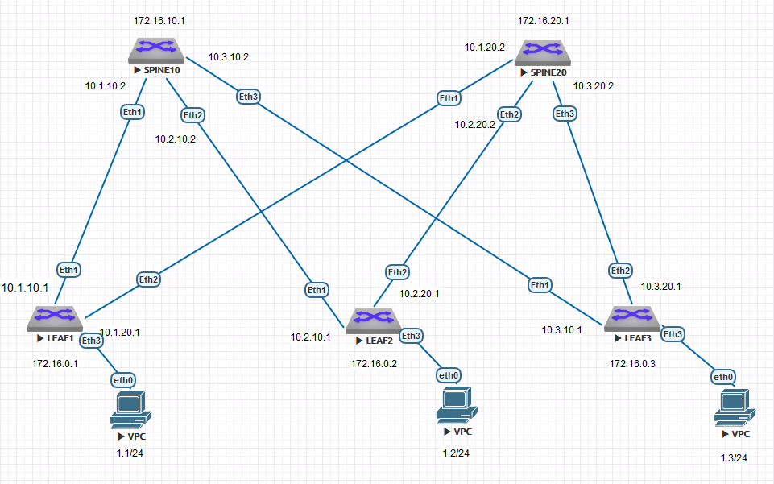

### Соединительные сети для eBGP:
10.1.10.0/30

10.2.10.0/30

10.3.10.0/30

10.1.20.0/30

10.2.20.0/30

10.3.20.0/30




### КОНФИГУРАЦИИ ОБОРУДОВАНИЯ:

#### LEAF1:
```
leaf1#show runn
! Command: show running-config
! device: leaf1 (vEOS-lab, EOS-4.29.2F)
!
! boot system flash:/vEOS-lab.swi
!
no aaa root
!
transceiver qsfp default-mode 4x10G
!
service routing protocols model ribd
!
hostname leaf1
!
spanning-tree mode mstp
!
vlan 10,20
!
interface Ethernet1
   mtu 9000
   no switchport
   ip address 10.1.10.1/30
!
interface Ethernet2
   mtu 9000
   no switchport
   ip address 10.1.20.1/30
!
interface Ethernet3
   switchport access vlan 10
!
interface Ethernet4
!
interface Ethernet5
!
interface Ethernet6
!
interface Ethernet7
!
interface Ethernet8
!
interface Loopback0
   ip address 172.16.0.1/32
!
interface Management1
!
interface Vxlan1
   vxlan source-interface Loopback0
   vxlan udp-port 4789
   vxlan vlan 10 vni 1010
!
ip routing
!
router bgp 65101
   router-id 172.16.0.1
   maximum-paths 4 ecmp 4
   neighbor 10.1.10.2 remote-as 65100
   neighbor 10.1.20.2 remote-as 65100
   neighbor 172.16.10.1 remote-as 65100
   neighbor 172.16.10.1 update-source Loopback0
   neighbor 172.16.10.1 send-community extended
   !
   vlan 10
      rd 65000:10
      route-target both 65000:10
      redistribute learned
   !
   address-family evpn
      neighbor 172.16.10.1 activate
   !
   address-family ipv4
      neighbor 10.1.10.2 activate
      neighbor 10.1.20.2 activate
      network 10.1.10.0/30
      network 10.1.20.0/30
      network 172.16.0.1/32
!
end

```

#### LEAF2:
```
leaf2#show runn
! Command: show running-config
! device: leaf2 (vEOS-lab, EOS-4.29.2F)
!
! boot system flash:/vEOS-lab.swi
!
no aaa root
!
transceiver qsfp default-mode 4x10G
!
service routing protocols model ribd
!
hostname leaf2
!
spanning-tree mode mstp
!
vlan 10,20
!
interface Ethernet1
   mtu 9000
   no switchport
   ip address 10.2.10.1/30
!
interface Ethernet2
   mtu 9000
   no switchport
   ip address 10.2.20.1/30
!
interface Ethernet3
   switchport access vlan 10
!
interface Ethernet4
!
interface Ethernet5
!
interface Ethernet6
!
interface Ethernet7
!
interface Ethernet8
!
interface Loopback0
   ip address 172.16.0.2/32
!
interface Management1
!
interface Vxlan1
   vxlan source-interface Loopback0
   vxlan udp-port 4789
   vxlan vlan 10 vni 1010
!
ip routing
!
router bgp 65102
   router-id 172.16.0.2
   maximum-paths 4 ecmp 4
   neighbor 10.2.10.2 remote-as 65100
   neighbor 10.2.20.2 remote-as 65100
   neighbor 172.16.10.1 remote-as 65100
   neighbor 172.16.10.1 update-source Loopback0
   neighbor 172.16.10.1 send-community extended
   !
   vlan 10
      rd 65000:10
      route-target both 65000:10
      redistribute learned
   !
   address-family evpn
      neighbor 172.16.10.1 activate
   !
   address-family ipv4
      neighbor 10.2.10.2 activate
      neighbor 10.2.20.2 activate
      network 10.2.10.0/30
      network 10.2.20.0/30
      network 172.16.0.2/32
!
end

```

#### SPINE10:
```
spine10#show runn
! Command: show running-config
! device: spine10 (vEOS-lab, EOS-4.29.2F)
!
! boot system flash:/vEOS-lab.swi
!
no aaa root
!
transceiver qsfp default-mode 4x10G
!
service routing protocols model ribd
!
hostname spine10
!
spanning-tree mode mstp
!
interface Ethernet1
   mtu 9000
   no switchport
   ip address 10.1.10.2/30
!
interface Ethernet2
   mtu 9000
   no switchport
   ip address 10.2.10.2/30
!
interface Ethernet3
   no switchport
   ip address 10.3.10.2/30
!
interface Ethernet4
!
interface Ethernet5
!
interface Ethernet6
!
interface Ethernet7
!
interface Ethernet8
!
interface Loopback0
   ip address 172.16.10.1/32
!
interface Management1
!
ip routing
!
router bgp 65100
   router-id 172.16.10.1
   maximum-paths 4 ecmp 4
   neighbor 10.1.10.1 remote-as 65101
   neighbor 10.2.10.1 remote-as 65102
   neighbor 10.3.10.1 remote-as 65103
   neighbor 172.16.0.1 remote-as 65101
   neighbor 172.16.0.1 update-source Loopback0
   neighbor 172.16.0.1 send-community extended
   neighbor 172.16.0.2 remote-as 65102
   neighbor 172.16.0.2 update-source Loopback0
   neighbor 172.16.0.2 send-community extended
   !
   address-family evpn
      neighbor 172.16.0.1 activate
      neighbor 172.16.0.2 activate
   !
   address-family ipv4
      neighbor 10.1.10.1 activate
      neighbor 10.2.10.1 activate
      neighbor 10.3.10.1 activate
      network 10.1.10.0/30
      network 10.2.10.0/30
      network 10.3.10.0/30
      network 172.16.10.1/32
!
end

```