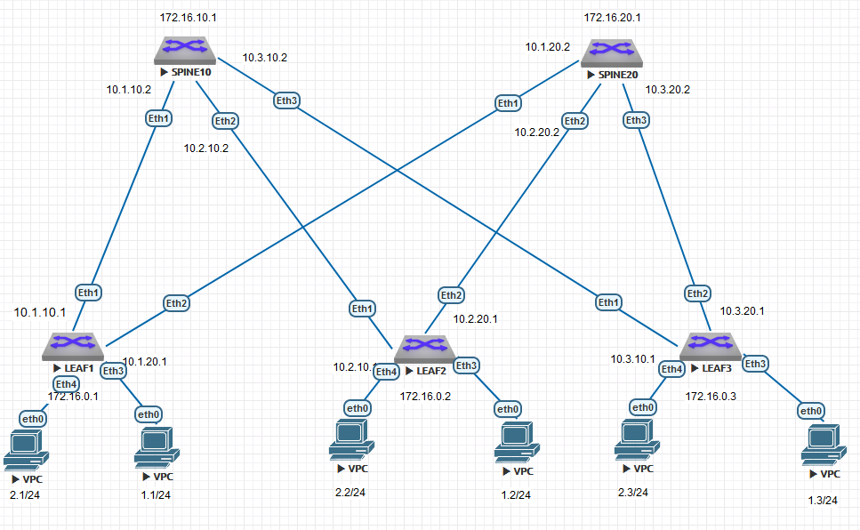

### Соединительные сети для eBGP:
10.1.10.0/30

10.2.10.0/30

10.3.10.0/30

10.1.20.0/30

10.2.20.0/30

10.3.20.0/30




### КОНФИГУРАЦИИ ОБОРУДОВАНИЯ:

#### LEAF1:
```
leaf1#show runn
! Command: show running-config
! device: leaf1 (vEOS-lab, EOS-4.29.2F)
!
! boot system flash:/vEOS-lab.swi
!
no aaa root
!
transceiver qsfp default-mode 4x10G
!
service routing protocols model multi-agent
!
hostname leaf1
!
spanning-tree mode mstp
!
vlan 10,20
!
vrf instance TENANT1
!
interface Ethernet1
   mtu 9000
   no switchport
   ip address 10.1.10.1/30
!
interface Ethernet2
   mtu 9000
   no switchport
   ip address 10.1.20.1/30
!
interface Ethernet3
   switchport access vlan 10
!
interface Ethernet4
   switchport access vlan 20
!
interface Ethernet5
!
interface Ethernet6
!
interface Ethernet7
!
interface Ethernet8
!
interface Loopback0
   ip address 172.16.0.1/32
!
interface Management1
!
interface Vlan10
   vrf TENANT1
   ip address virtual 192.168.1.254/24
!
interface Vlan20
   vrf TENANT1
   ip address virtual 192.168.2.254/24
!
interface Vxlan1
   vxlan source-interface Loopback0
   vxlan udp-port 4789
   vxlan vlan 10 vni 1010
   vxlan vlan 20 vni 1020
   vxlan vrf TENANT1 vni 5000
!
ip virtual-router mac-address 00:00:00:00:00:01
!
ip routing
ip routing vrf TENANT1
!
router bgp 65101
   router-id 172.16.0.1
   maximum-paths 4 ecmp 4
   neighbor 10.1.10.2 remote-as 65100
   neighbor 10.1.20.2 remote-as 65100
   neighbor 172.16.10.1 remote-as 65100
   neighbor 172.16.10.1 update-source Loopback0
   neighbor 172.16.10.1 ebgp-multihop 2
   neighbor 172.16.10.1 send-community extended
   neighbor 172.16.20.1 remote-as 65100
   neighbor 172.16.20.1 update-source Loopback0
   neighbor 172.16.20.1 ebgp-multihop 2
   neighbor 172.16.20.1 send-community extended
   !
   vlan 10
      rd 65000:10
      route-target both 65000:10
      redistribute learned
   !
   vlan 20
      rd 65000:20
      route-target both 65000:20
      redistribute learned
   !
   address-family evpn
      neighbor 172.16.10.1 activate
      neighbor 172.16.20.1 activate
   !
   address-family ipv4
      neighbor 10.1.10.2 activate
      neighbor 10.1.20.2 activate
      network 10.1.10.0/30
      network 10.1.20.0/30
      network 172.16.0.1/32
   !
   vrf TENANT1
      rd 65000:5000
      route-target import evpn 65000:5000
      route-target export evpn 65000:5000
!
end

```

#### LEAF2:
```
leaf2#show runn
! Command: show running-config
! device: leaf2 (vEOS-lab, EOS-4.29.2F)
!
! boot system flash:/vEOS-lab.swi
!
no aaa root
!
transceiver qsfp default-mode 4x10G
!
service routing protocols model multi-agent
!
hostname leaf2
!
spanning-tree mode mstp
!
vlan 10,20
!
vrf instance TENANT1
!
interface Ethernet1
   mtu 9000
   no switchport
   ip address 10.2.10.1/30
!
interface Ethernet2
   mtu 9000
   no switchport
   ip address 10.2.20.1/30
!
interface Ethernet3
   switchport access vlan 10
!
interface Ethernet4
   switchport access vlan 20
!
interface Ethernet5
!
interface Ethernet6
!
interface Ethernet7
!
interface Ethernet8
!
interface Loopback0
   ip address 172.16.0.2/32
!
interface Management1
!
interface Vlan10
   vrf TENANT1
   ip address virtual 192.168.1.254/24
!
interface Vlan20
   vrf TENANT1
   ip address virtual 192.168.2.254/24
!
interface Vxlan1
   vxlan source-interface Loopback0
   vxlan udp-port 4789
   vxlan vlan 10 vni 1010
   vxlan vlan 20 vni 1020
   vxlan vrf TENANT1 vni 5000
!
ip virtual-router mac-address 00:00:00:00:00:01
!
ip routing
ip routing vrf TENANT1
!
router bgp 65102
   router-id 172.16.0.2
   maximum-paths 4 ecmp 4
   neighbor 10.2.10.2 remote-as 65100
   neighbor 10.2.20.2 remote-as 65100
   neighbor 172.16.10.1 remote-as 65100
   neighbor 172.16.10.1 update-source Loopback0
   neighbor 172.16.10.1 ebgp-multihop 2
   neighbor 172.16.10.1 send-community extended
   neighbor 172.16.20.1 remote-as 65100
   neighbor 172.16.20.1 update-source Loopback0
   neighbor 172.16.20.1 ebgp-multihop 2
   neighbor 172.16.20.1 send-community extended
   !
   vlan 10
      rd 65000:10
      route-target both 65000:10
      redistribute learned
   !
   vlan 20
      rd 65000:20
      route-target both 65000:20
      redistribute learned
   !
   address-family evpn
      neighbor 172.16.10.1 activate
      neighbor 172.16.20.1 activate
   !
   address-family ipv4
      neighbor 10.2.10.2 activate
      neighbor 10.2.20.2 activate
      network 10.2.10.0/30
      network 10.2.20.0/30
      network 172.16.0.2/32
   !
   vrf TENANT1
      rd 65000:5000
      route-target import evpn 65000:5000
      route-target export 65000:5000
      route-target export evpn 65000:5000
!
end

```

#### LEAF3:
```
leaf3#show runn
! Command: show running-config
! device: leaf3 (vEOS-lab, EOS-4.29.2F)
!
! boot system flash:/vEOS-lab.swi
!
no aaa root
!
transceiver qsfp default-mode 4x10G
!
service routing protocols model multi-agent
!
hostname leaf3
!
spanning-tree mode mstp
!
vlan 10,20
!
vrf instance TENANT1
!
interface Ethernet1
   mtu 9000
   no switchport
   ip address 10.3.10.1/30
!
interface Ethernet2
   mtu 9000
   no switchport
   ip address 10.3.20.1/30
!
interface Ethernet3
   switchport access vlan 10
!
interface Ethernet4
   switchport access vlan 20
!
interface Ethernet5
!
interface Ethernet6
!
interface Ethernet7
!
interface Ethernet8
!
interface Loopback0
   ip address 172.16.0.3/32
!
interface Management1
!
interface Vlan10
   vrf TENANT1
   ip address virtual 192.168.1.254/24
!
interface Vlan20
   vrf TENANT1
   ip address virtual 192.168.2.254/24
!
interface Vxlan1
   vxlan source-interface Loopback0
   vxlan udp-port 4789
   vxlan vlan 10 vni 1010
   vxlan vlan 20 vni 1020
   vxlan vrf TENANT1 vni 5000
!
ip virtual-router mac-address 00:00:00:00:00:01
!
ip routing
ip routing vrf TENANT1
!
router bgp 65103
   router-id 172.16.0.3
   maximum-paths 4 ecmp 4
   neighbor 10.3.10.2 remote-as 65100
   neighbor 10.3.20.2 remote-as 65100
   neighbor 172.16.10.1 remote-as 65100
   neighbor 172.16.10.1 update-source Loopback0
   neighbor 172.16.10.1 ebgp-multihop 2
   neighbor 172.16.10.1 send-community extended
   neighbor 172.16.20.1 remote-as 65100
   neighbor 172.16.20.1 update-source Loopback0
   neighbor 172.16.20.1 ebgp-multihop 2
   neighbor 172.16.20.1 send-community extended
   !
   vlan 10
      rd 65000:10
      route-target both 65000:10
      redistribute learned
   !
   vlan 20
      rd 65000:20
      route-target both 65000:20
      redistribute learned
   !
   address-family evpn
      neighbor 172.16.10.1 activate
      neighbor 172.16.20.1 activate
   !
   address-family ipv4
      neighbor 10.3.10.2 activate
      neighbor 10.3.20.2 activate
      network 10.3.10.0/30
      network 10.3.20.0/30
      network 172.16.0.3/32
   !
   vrf TENANT1
      rd 65000:5000
      route-target import evpn 65000:5000
      route-target export 65000:5000
      route-target export evpn 65000:5000
!
end

```

#### SPINE10:
```
spine10#show runn
! Command: show running-config
! device: spine10 (vEOS-lab, EOS-4.29.2F)
!
! boot system flash:/vEOS-lab.swi
!
no aaa root
!
transceiver qsfp default-mode 4x10G
!
service routing protocols model multi-agent
!
hostname spine10
!
spanning-tree mode mstp
!
interface Ethernet1
   mtu 9000
   no switchport
   ip address 10.1.10.2/30
!
interface Ethernet2
   mtu 9000
   no switchport
   ip address 10.2.10.2/30
!
interface Ethernet3
   no switchport
   ip address 10.3.10.2/30
!
interface Ethernet4
!
interface Ethernet5
!
interface Ethernet6
!
interface Ethernet7
!
interface Ethernet8
!
interface Loopback0
   ip address 172.16.10.1/32
!
interface Management1
!
ip routing
!
router bgp 65100
   router-id 172.16.10.1
   maximum-paths 4 ecmp 4
   neighbor 10.1.10.1 remote-as 65101
   neighbor 10.2.10.1 remote-as 65102
   neighbor 10.3.10.1 remote-as 65103
   neighbor 172.16.0.1 remote-as 65101
   neighbor 172.16.0.1 update-source Loopback0
   neighbor 172.16.0.1 ebgp-multihop 2
   neighbor 172.16.0.1 send-community extended
   neighbor 172.16.0.2 remote-as 65102
   neighbor 172.16.0.2 update-source Loopback0
   neighbor 172.16.0.2 ebgp-multihop 2
   neighbor 172.16.0.2 send-community extended
   neighbor 172.16.0.3 remote-as 65103
   neighbor 172.16.0.3 update-source Loopback0
   neighbor 172.16.0.3 ebgp-multihop 2
   neighbor 172.16.0.3 send-community extended
   !
   address-family evpn
      neighbor 172.16.0.1 activate
      neighbor 172.16.0.2 activate
      neighbor 172.16.0.3 activate
   !
   address-family ipv4
      neighbor 10.1.10.1 activate
      neighbor 10.2.10.1 activate
      neighbor 10.3.10.1 activate
      network 10.1.10.0/30
      network 10.2.10.0/30
      network 10.3.10.0/30
      network 172.16.10.1/32
!
end

```

#### SPINE20:
```
spine20#show runn
! Command: show running-config
! device: spine20 (vEOS-lab, EOS-4.29.2F)
!
! boot system flash:/vEOS-lab.swi
!
no aaa root
!
transceiver qsfp default-mode 4x10G
!
service routing protocols model multi-agent
!
hostname spine20
!
spanning-tree mode mstp
!
interface Ethernet1
   mtu 9000
   no switchport
   ip address 10.1.20.2/30
!
interface Ethernet2
   mtu 9000
   no switchport
   ip address 10.2.20.2/30
!
interface Ethernet3
   mtu 9000
   no switchport
   ip address 10.3.20.2/30
!
interface Ethernet4
!
interface Ethernet5
!
interface Ethernet6
!
interface Ethernet7
!
interface Ethernet8
!
interface Loopback0
   ip address 172.16.20.1/32
!
interface Management1
!
ip routing
!
router bgp 65100
   router-id 172.16.20.1
   maximum-paths 4 ecmp 4
   neighbor 10.1.20.1 remote-as 65101
   neighbor 10.2.20.1 remote-as 65102
   neighbor 10.3.20.1 remote-as 65103
   neighbor 172.16.0.1 remote-as 65101
   neighbor 172.16.0.1 update-source Loopback0
   neighbor 172.16.0.1 ebgp-multihop 2
   neighbor 172.16.0.1 send-community extended
   neighbor 172.16.0.2 remote-as 65102
   neighbor 172.16.0.2 update-source Loopback0
   neighbor 172.16.0.2 ebgp-multihop 2
   neighbor 172.16.0.2 send-community extended
   neighbor 172.16.0.3 remote-as 65103
   neighbor 172.16.0.3 update-source Loopback0
   neighbor 172.16.0.3 ebgp-multihop 2
   neighbor 172.16.0.3 send-community extended
   !
   address-family evpn
      neighbor 172.16.0.1 activate
      neighbor 172.16.0.2 activate
      neighbor 172.16.0.3 activate
   !
   address-family ipv4
      neighbor 10.1.20.1 activate
      neighbor 10.2.20.1 activate
      neighbor 10.3.20.1 activate
      network 10.1.20.0/30
      network 10.2.20.0/30
      network 10.3.20.0/30
      network 172.16.20.1/32
!
end

```

### show ip route vrf TENANT1

#### LEAF1
```
 B E      192.168.1.2/32 [200/0] via VTEP 172.16.0.2 VNI 5000 router-mac 50:00:00:d5:5d:c0 local-interface Vxlan1
 B E      192.168.1.3/32 [200/0] via VTEP 172.16.0.3 VNI 5000 router-mac 50:00:00:03:37:66 local-interface Vxlan1
 C        192.168.1.0/24 is directly connected, Vlan10
 B E      192.168.2.2/32 [200/0] via VTEP 172.16.0.2 VNI 5000 router-mac 50:00:00:d5:5d:c0 local-interface Vxlan1
 B E      192.168.2.3/32 [200/0] via VTEP 172.16.0.3 VNI 5000 router-mac 50:00:00:03:37:66 local-interface Vxlan1
 C        192.168.2.0/24 is directly connected, Vlan20
```
#### LEAF2
```
 B E      192.168.1.3/32 [200/0] via VTEP 172.16.0.3 VNI 5000 router-mac 50:00:00:03:37:66 local-interface Vxlan1
 C        192.168.1.0/24 is directly connected, Vlan10
 B E      192.168.2.1/32 [200/0] via VTEP 172.16.0.1 VNI 5000 router-mac 50:00:00:d7:ee:0b local-interface Vxlan1
 B E      192.168.2.3/32 [200/0] via VTEP 172.16.0.3 VNI 5000 router-mac 50:00:00:03:37:66 local-interface Vxlan1
 C        192.168.2.0/24 is directly connected, Vlan20
```
#### LEAF3
```
 B E      192.168.1.2/32 [200/0] via VTEP 172.16.0.2 VNI 5000 router-mac 50:00:00:d5:5d:c0 local-interface Vxlan1
 C        192.168.1.0/24 is directly connected, Vlan10
 B E      192.168.2.1/32 [200/0] via VTEP 172.16.0.1 VNI 5000 router-mac 50:00:00:d7:ee:0b local-interface Vxlan1
 B E      192.168.2.2/32 [200/0] via VTEP 172.16.0.2 VNI 5000 router-mac 50:00:00:d5:5d:c0 local-interface Vxlan1
 C        192.168.2.0/24 is directly connected, Vlan20
```

### ping

#### ВСЕ УСТРОЙСТВА С VPC 192.168.1.1
```
VPCS> show ip

NAME        : VPCS[1]
IP/MASK     : 192.168.1.1/24
GATEWAY     : 192.168.1.254
DNS         :
MAC         : 00:50:79:66:68:0b
LPORT       : 20000
RHOST:PORT  : 127.0.0.1:30000
MTU         : 1500

VPCS> ping 192.168.1.2

84 bytes from 192.168.1.2 icmp_seq=1 ttl=64 time=145.280 ms
84 bytes from 192.168.1.2 icmp_seq=2 ttl=64 time=46.492 ms
84 bytes from 192.168.1.2 icmp_seq=3 ttl=64 time=37.272 ms
84 bytes from 192.168.1.2 icmp_seq=4 ttl=64 time=57.821 ms
84 bytes from 192.168.1.2 icmp_seq=5 ttl=64 time=45.732 ms

VPCS> ping 192.168.1.3

84 bytes from 192.168.1.3 icmp_seq=1 ttl=64 time=167.922 ms
84 bytes from 192.168.1.3 icmp_seq=2 ttl=64 time=37.566 ms
84 bytes from 192.168.1.3 icmp_seq=3 ttl=64 time=38.414 ms
84 bytes from 192.168.1.3 icmp_seq=4 ttl=64 time=35.953 ms
84 bytes from 192.168.1.3 icmp_seq=5 ttl=64 time=42.505 ms

VPCS> ping 192.168.2.1

84 bytes from 192.168.2.1 icmp_seq=1 ttl=63 time=46.188 ms
84 bytes from 192.168.2.1 icmp_seq=2 ttl=63 time=31.381 ms
84 bytes from 192.168.2.1 icmp_seq=3 ttl=63 time=22.276 ms
84 bytes from 192.168.2.1 icmp_seq=4 ttl=63 time=16.988 ms
84 bytes from 192.168.2.1 icmp_seq=5 ttl=63 time=15.117 ms

VPCS> ping 192.168.2.2

84 bytes from 192.168.2.2 icmp_seq=1 ttl=62 time=946.060 ms
84 bytes from 192.168.2.2 icmp_seq=2 ttl=62 time=78.874 ms
84 bytes from 192.168.2.2 icmp_seq=3 ttl=62 time=371.452 ms
84 bytes from 192.168.2.2 icmp_seq=4 ttl=62 time=40.347 ms
84 bytes from 192.168.2.2 icmp_seq=5 ttl=62 time=40.379 ms

VPCS> ping 192.168.2.3

84 bytes from 192.168.2.3 icmp_seq=1 ttl=62 time=720.242 ms
84 bytes from 192.168.2.3 icmp_seq=2 ttl=62 time=43.028 ms
84 bytes from 192.168.2.3 icmp_seq=3 ttl=62 time=37.966 ms
84 bytes from 192.168.2.3 icmp_seq=4 ttl=62 time=40.923 ms
84 bytes from 192.168.2.3 icmp_seq=5 ttl=62 time=48.002 ms
```
