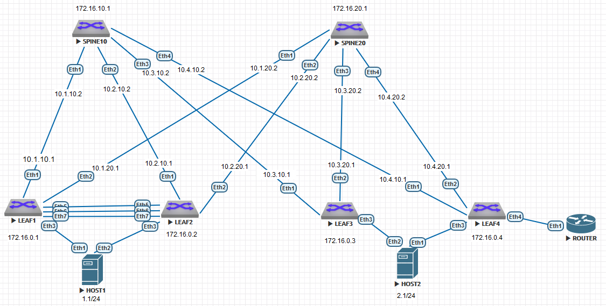

### Соединительные сети для eBGP:
10.1.10.0/30

10.2.10.0/30

10.3.10.0/30

10.4.10.0/30

10.1.20.0/30

10.2.20.0/30

10.3.20.0/30

10.4.20.0/30




### КОНФИГУРАЦИИ ОБОРУДОВАНИЯ:

#### LEAF1:
```
leaf1#show runn
! Command: show running-config
! device: leaf1 (vEOS-lab, EOS-4.29.2F)
!
! boot system flash:/vEOS-lab.swi
!
no aaa root
!
transceiver qsfp default-mode 4x10G
!
service routing protocols model multi-agent
!
hostname leaf1
!
spanning-tree mode mstp
!
vlan 10,20,4094
!
vrf instance MGMT
!
vrf instance TENANT1
!
interface Port-Channel3
   switchport mode trunk
   mlag 1
!
interface Port-Channel56
   switchport trunk allowed vlan 4094
   switchport mode trunk
   spanning-tree link-type point-to-point
!
interface Ethernet1
   mtu 9000
   no switchport
   ip address 10.1.10.1/30
!
interface Ethernet2
   mtu 9000
   no switchport
   ip address 10.1.20.1/30
!
interface Ethernet3
   switchport access vlan 10
   switchport trunk allowed vlan 10,20,30,40
   switchport mode trunk
   channel-group 3 mode active
!
interface Ethernet4
   switchport access vlan 20
!
interface Ethernet5
   channel-group 56 mode active
!
interface Ethernet6
   channel-group 56 mode active
!
interface Ethernet7
   no switchport
   vrf MGMT
   ip address 192.168.0.1/30
!
interface Ethernet8
!
interface Loopback0
   ip address 172.16.0.1/32
!
interface Management1
!
interface Vlan10
   vrf TENANT1
   ip address virtual 192.168.1.254/24
!
interface Vlan20
   vrf TENANT1
   ip address virtual 192.168.2.254/24
!
interface Vlan4094
   ip address 172.16.101.1/30
!
interface Vxlan1
   vxlan source-interface Loopback0
   vxlan udp-port 4789
   vxlan vlan 10 vni 1010
   vxlan vlan 20 vni 1020
   vxlan vrf TENANT1 vni 5000
!
ip virtual-router mac-address 00:00:00:00:00:01
!
ip routing
ip routing vrf MGMT
ip routing vrf TENANT1
!
mlag configuration
   domain-id LEAVES-1-2
   local-interface Vlan4094
   peer-address 172.16.101.2
   peer-address heartbeat 192.168.0.2 vrf MGMT
   peer-link Port-Channel56
   dual-primary detection delay 1 action errdisable all-interfaces
!
router bgp 65101
   router-id 172.16.0.1
   maximum-paths 4 ecmp 4
   neighbor 10.1.10.2 remote-as 65100
   neighbor 10.1.20.2 remote-as 65100
   neighbor 172.16.10.1 remote-as 65100
   neighbor 172.16.10.1 update-source Loopback0
   neighbor 172.16.10.1 ebgp-multihop 2
   neighbor 172.16.10.1 send-community extended
   neighbor 172.16.20.1 remote-as 65100
   neighbor 172.16.20.1 update-source Loopback0
   neighbor 172.16.20.1 ebgp-multihop 2
   neighbor 172.16.20.1 send-community extended
   neighbor 172.16.101.2 remote-as 65102
   neighbor 172.16.101.2 next-hop-self
   !
   vlan 10
      rd 65000:10
      route-target both 65000:10
      redistribute learned
   !
   vlan 20
      rd 65000:20
      route-target both 65000:20
      redistribute learned
   !
   address-family evpn
      neighbor 172.16.10.1 activate
      neighbor 172.16.20.1 activate
   !
   address-family ipv4
      neighbor 10.1.10.2 activate
      neighbor 10.1.20.2 activate
      neighbor 172.16.101.2 activate
      network 10.1.10.0/30
      network 10.1.20.0/30
      network 172.16.0.1/32
   !
   vrf TENANT1
      rd 65000:5000
      route-target import evpn 65000:5000
      route-target export evpn 65000:5000
!
end

```

#### LEAF2:
```
leaf2#show runn
! Command: show running-config
! device: leaf2 (vEOS-lab, EOS-4.29.2F)
!
! boot system flash:/vEOS-lab.swi
!
no aaa root
!
transceiver qsfp default-mode 4x10G
!
service routing protocols model multi-agent
!
hostname leaf2
!
spanning-tree mode mstp
!
vlan 10,20,4094
!
vrf instance MGMT
!
vrf instance TENANT1
!
interface Port-Channel3
   switchport mode trunk
   mlag 1
!
interface Port-Channel56
   switchport trunk allowed vlan 4094
   switchport mode trunk
   spanning-tree link-type point-to-point
!
interface Ethernet1
   mtu 9000
   no switchport
   ip address 10.2.10.1/30
!
interface Ethernet2
   mtu 9000
   no switchport
   ip address 10.2.20.1/30
!
interface Ethernet3
   switchport access vlan 10
   switchport trunk allowed vlan 10,20,30,40
   switchport mode trunk
   channel-group 3 mode active
!
interface Ethernet4
   switchport access vlan 40
!
interface Ethernet5
   channel-group 56 mode active
!
interface Ethernet6
   channel-group 56 mode active
!
interface Ethernet7
   no switchport
   vrf MGMT
   ip address 192.168.0.2/30
!
interface Ethernet8
!
interface Loopback0
   ip address 172.16.0.2/32
!
interface Management1
!
interface Vlan10
   vrf TENANT1
   ip address virtual 192.168.1.254/24
!
interface Vlan20
   vrf TENANT1
   ip address virtual 192.168.2.254/24
!
interface Vlan4094
   ip address 172.16.101.2/30
!
interface Vxlan1
   vxlan source-interface Loopback0
   vxlan udp-port 4789
   vxlan vlan 10 vni 1010
   vxlan vlan 20 vni 1020
   vxlan vrf TENANT1 vni 5000
!
ip virtual-router mac-address 00:00:00:00:00:01
!
ip routing
ip routing vrf MGMT
ip routing vrf TENANT1
!
mlag configuration
   domain-id LEAVES-1-2
   local-interface Vlan4094
   peer-address 172.16.101.1
   peer-address heartbeat 192.168.0.1 vrf MGMT
   peer-link Port-Channel56
   dual-primary detection delay 1 action errdisable all-interfaces
!
router bgp 65102
   router-id 172.16.0.2
   maximum-paths 4 ecmp 4
   neighbor 10.2.10.2 remote-as 65100
   neighbor 10.2.20.2 remote-as 65100
   neighbor 172.16.10.1 remote-as 65100
   neighbor 172.16.10.1 update-source Loopback0
   neighbor 172.16.10.1 ebgp-multihop 2
   neighbor 172.16.10.1 send-community extended
   neighbor 172.16.20.1 remote-as 65100
   neighbor 172.16.20.1 update-source Loopback0
   neighbor 172.16.20.1 ebgp-multihop 2
   neighbor 172.16.20.1 send-community extended
   neighbor 172.16.101.1 remote-as 65101
   neighbor 172.16.101.1 next-hop-self
   !
   vlan 10
      rd 65000:10
      route-target both 65000:10
      redistribute learned
   !
   vlan 20
      rd 65000:20
      route-target both 65000:20
      redistribute learned
   !
   address-family evpn
      neighbor 172.16.10.1 activate
      neighbor 172.16.20.1 activate
   !
   address-family ipv4
      neighbor 10.2.10.2 activate
      neighbor 10.2.20.2 activate
      neighbor 172.16.101.1 activate
      network 10.2.10.0/30
      network 10.2.20.0/30
      network 172.16.0.2/32
   !
   vrf TENANT1
      rd 65000:5000
      route-target import evpn 65000:5000
      route-target export 65000:5000
      route-target export evpn 65000:5000
!
end

```

#### LEAF3:
```
leaf3#show  runn
! Command: show running-config
! device: leaf3 (vEOS-lab, EOS-4.29.2F)
!
! boot system flash:/vEOS-lab.swi
!
no aaa root
!
transceiver qsfp default-mode 4x10G
!
service routing protocols model multi-agent
!
hostname leaf3
!
spanning-tree mode mstp
!
vlan 10,20
!
vrf instance TENANT1
!
interface Port-Channel3
   switchport trunk allowed vlan 10,20
   switchport mode trunk
   !
   evpn ethernet-segment
      identifier 0000:0000:0000:0000:0001
      designated-forwarder election algorithm preference 20
      route-target import 00:00:00:00:00:01
   lacp system-id 1111.2222.3333
!
interface Ethernet1
   mtu 9000
   no switchport
   ip address 10.3.10.1/30
!
interface Ethernet2
   mtu 9000
   no switchport
   ip address 10.3.20.1/30
!
interface Ethernet3
   switchport access vlan 10
   switchport trunk allowed vlan 10,20
   switchport mode trunk
   channel-group 3 mode active
!
interface Ethernet4
   switchport access vlan 20
!
interface Ethernet5
!
interface Ethernet6
!
interface Ethernet7
!
interface Ethernet8
!
interface Loopback0
   ip address 172.16.0.3/32
!
interface Management1
!
interface Vlan10
   vrf TENANT1
   ip address virtual 192.168.1.254/24
!
interface Vlan20
   vrf TENANT1
   ip address virtual 192.168.2.254/24
!
interface Vxlan1
   vxlan source-interface Loopback0
   vxlan udp-port 4789
   vxlan vlan 10 vni 1010
   vxlan vlan 20 vni 1020
   vxlan vrf TENANT1 vni 5000
!
ip virtual-router mac-address 00:00:00:00:00:01
!
ip routing
ip routing vrf TENANT1
!
router bgp 65103
   router-id 172.16.0.3
   maximum-paths 4 ecmp 4
   neighbor 10.3.10.2 remote-as 65100
   neighbor 10.3.20.2 remote-as 65100
   neighbor 172.16.10.1 remote-as 65100
   neighbor 172.16.10.1 update-source Loopback0
   neighbor 172.16.10.1 ebgp-multihop 2
   neighbor 172.16.10.1 send-community extended
   neighbor 172.16.20.1 remote-as 65100
   neighbor 172.16.20.1 update-source Loopback0
   neighbor 172.16.20.1 ebgp-multihop 2
   neighbor 172.16.20.1 send-community extended
   !
   vlan 10
      rd 65000:10
      route-target both 65000:10
      redistribute learned
   !
   vlan 20
      rd 65000:20
      route-target both 65000:20
      redistribute learned
   !
   address-family evpn
      neighbor 172.16.10.1 activate
      neighbor 172.16.20.1 activate
   !
   address-family ipv4
      neighbor 10.3.10.2 activate
      neighbor 10.3.20.2 activate
      network 10.3.10.0/30
      network 10.3.20.0/30
      network 172.16.0.3/32
   !
   vrf TENANT1
      rd 65000:5000
      route-target import evpn 65000:5000
      route-target export 65000:5000
      route-target export evpn 65000:5000
!
end

```

#### LEAF4:
```
leaf4#show runn
! Command: show running-config
! device: leaf4 (vEOS-lab, EOS-4.29.2F)
!
! boot system flash:/vEOS-lab.swi
!
no aaa root
!
transceiver qsfp default-mode 4x10G
!
service routing protocols model multi-agent
!
hostname leaf4
!
spanning-tree mode mstp
!
vlan 10,20
!
vrf instance OUTSIDE
!
vrf instance TENANT1
!
interface Port-Channel3
   switchport trunk allowed vlan 10,20
   switchport mode trunk
   !
   evpn ethernet-segment
      identifier 0000:0000:0000:0000:0001
      designated-forwarder election algorithm preference 50
      route-target import 00:00:00:00:00:01
   lacp system-id 1111.2222.3333
!
interface Ethernet1
   mtu 9000
   no switchport
   ip address 10.4.10.1/30
!
interface Ethernet2
   mtu 9000
   no switchport
   ip address 10.4.20.1/30
!
interface Ethernet3
   switchport trunk allowed vlan 10,20
   switchport mode trunk
   channel-group 3 mode active
!
interface Ethernet4
   no switchport
   vrf OUTSIDE
   ip address 10.100.100.1/30
!
interface Ethernet5
!
interface Ethernet6
!
interface Ethernet7
!
interface Ethernet8
!
interface Loopback0
   ip address 172.16.0.4/32
!
interface Management1
!
interface Vlan10
   vrf TENANT1
   ip address virtual 192.168.1.254/24
!
interface Vlan20
   vrf TENANT1
   ip address virtual 192.168.2.254/24
!
interface Vxlan1
   vxlan source-interface Loopback0
   vxlan udp-port 4789
   vxlan vlan 10 vni 1010
   vxlan vlan 20 vni 1020
   vxlan vrf TENANT1 vni 5000
!
ip virtual-router mac-address 00:00:00:00:00:01
!
ip routing
ip routing vrf OUTSIDE
ip routing vrf TENANT1
!
router bgp 65104
   router-id 172.16.0.4
   maximum-paths 4 ecmp 4
   neighbor 10.4.10.2 remote-as 65100
   neighbor 10.4.20.2 remote-as 65100
   neighbor 10.100.100.2 remote-as 65200
   neighbor 172.16.10.1 remote-as 65100
   neighbor 172.16.10.1 update-source Loopback0
   neighbor 172.16.10.1 ebgp-multihop 2
   neighbor 172.16.10.1 send-community extended
   neighbor 172.16.20.1 remote-as 65100
   neighbor 172.16.20.1 update-source Loopback0
   neighbor 172.16.20.1 ebgp-multihop 2
   neighbor 172.16.20.1 send-community extended
   !
   vlan 10
      rd 65000:10
      route-target both 65000:10
      redistribute learned
   !
   vlan 20
      rd 65000:20
      route-target both 65000:20
      redistribute learned
   !
   address-family evpn
      neighbor 172.16.10.1 activate
      neighbor 172.16.20.1 activate
   !
   address-family ipv4
      no neighbor 10.3.10.2 activate
      no neighbor 10.3.20.2 activate
      neighbor 10.4.10.2 activate
      neighbor 10.4.20.2 activate
      neighbor 10.100.100.2 activate
      network 10.4.10.0/30
      network 10.4.20.0/30
      network 10.100.100.0/30
      network 172.16.0.4/32
   !
   vrf OUTSIDE
      rd 65000:900
      route-target import evpn 65000:900
      route-target export evpn 65000:900
      neighbor 10.100.100.2 remote-as 65200
      neighbor 10.100.100.2 send-community extended
      !
      address-family ipv4
         neighbor 10.100.100.2 activate
         network 10.100.100.0/30
         redistribute bgp leaked
   !
   vrf TENANT1
      rd 65000:5000
      route-target import evpn 65000:900
      route-target import evpn 65000:5000
      route-target export 65000:5000
      route-target export evpn 65000:5000
!
end

```

#### ROUTER:

```
ROUTER#show runn
! Command: show running-config
! device: ROUTER (vEOS-lab, EOS-4.29.2F)
!
! boot system flash:/vEOS-lab.swi
!
no aaa root
!
transceiver qsfp default-mode 4x10G
!
service routing protocols model multi-agent
!
hostname ROUTER
!
spanning-tree mode mstp
!
vrf instance OUTSIDE
!
interface Ethernet1
   no switchport
   vrf OUTSIDE
   ip address 10.100.100.2/30
!
interface Ethernet2
!
interface Ethernet3
!
interface Ethernet4
!
interface Ethernet5
!
interface Ethernet6
!
interface Ethernet7
!
interface Ethernet8
!
interface Loopback0
   vrf OUTSIDE
   ip address 194.85.62.1/32
!
interface Management1
!
ip routing
ip routing vrf OUTSIDE
!
router bgp 65200
   address-family ipv4
      no neighbor 10.100.100.1 activate
   !
   vrf OUTSIDE
      neighbor 10.100.100.1 remote-as 65104
      neighbor 10.100.100.1 send-community extended
      !
      address-family ipv4
         neighbor 10.100.100.1 activate
         network 194.85.62.1/32
!
end

```


#### SPINE10:
```
spine10#show runn
! Command: show running-config
! device: spine10 (vEOS-lab, EOS-4.29.2F)
!
! boot system flash:/vEOS-lab.swi
!
no aaa root
!
transceiver qsfp default-mode 4x10G
!
service routing protocols model multi-agent
!
hostname spine10
!
spanning-tree mode mstp
!
interface Ethernet1
   mtu 9000
   no switchport
   ip address 10.1.10.2/30
!
interface Ethernet2
   mtu 9000
   no switchport
   ip address 10.2.10.2/30
!
interface Ethernet3
   mtu 9000
   no switchport
   ip address 10.3.10.2/30
!
interface Ethernet4
   mtu 9000
   no switchport
   ip address 10.4.10.2/30
!
interface Ethernet5
!
interface Ethernet6
!
interface Ethernet7
!
interface Ethernet8
!
interface Loopback0
   ip address 172.16.10.1/32
!
interface Management1
!
ip routing
!
router bgp 65100
   router-id 172.16.10.1
   maximum-paths 4 ecmp 4
   neighbor 10.1.10.1 remote-as 65101
   neighbor 10.2.10.1 remote-as 65102
   neighbor 10.3.10.1 remote-as 65103
   neighbor 10.4.10.1 remote-as 65104
   neighbor 172.16.0.1 remote-as 65101
   neighbor 172.16.0.1 update-source Loopback0
   neighbor 172.16.0.1 ebgp-multihop 2
   neighbor 172.16.0.1 send-community extended
   neighbor 172.16.0.2 remote-as 65102
   neighbor 172.16.0.2 update-source Loopback0
   neighbor 172.16.0.2 ebgp-multihop 2
   neighbor 172.16.0.2 send-community extended
   neighbor 172.16.0.3 remote-as 65103
   neighbor 172.16.0.3 update-source Loopback0
   neighbor 172.16.0.3 ebgp-multihop 2
   neighbor 172.16.0.3 send-community extended
   neighbor 172.16.0.4 remote-as 65104
   neighbor 172.16.0.4 update-source Loopback0
   neighbor 172.16.0.4 ebgp-multihop 2
   neighbor 172.16.0.4 send-community extended
   !
   address-family evpn
      neighbor 172.16.0.1 activate
      neighbor 172.16.0.2 activate
      neighbor 172.16.0.3 activate
      neighbor 172.16.0.4 activate
   !
   address-family ipv4
      neighbor 10.1.10.1 activate
      neighbor 10.2.10.1 activate
      neighbor 10.3.10.1 activate
      neighbor 10.4.10.1 activate
      network 10.1.10.0/30
      network 10.2.10.0/30
      network 10.3.10.0/30
      network 10.4.10.0/30
      network 172.16.10.1/32
!
end

```

#### SPINE20:
```
spine20#show runn
! Command: show running-config
! device: spine20 (vEOS-lab, EOS-4.29.2F)
!
! boot system flash:/vEOS-lab.swi
!
no aaa root
!
transceiver qsfp default-mode 4x10G
!
service routing protocols model multi-agent
!
hostname spine20
!
spanning-tree mode mstp
!
interface Ethernet1
   mtu 9000
   no switchport
   ip address 10.1.20.2/30
!
interface Ethernet2
   mtu 9000
   no switchport
   ip address 10.2.20.2/30
!
interface Ethernet3
   mtu 9000
   no switchport
   ip address 10.3.20.2/30
!
interface Ethernet4
   mtu 9000
   no switchport
   ip address 10.4.20.2/30
!
interface Ethernet5
!
interface Ethernet6
!
interface Ethernet7
!
interface Ethernet8
!
interface Loopback0
   ip address 172.16.20.1/32
!
interface Management1
!
ip routing
!
router bgp 65100
   router-id 172.16.20.1
   maximum-paths 4 ecmp 4
   neighbor 10.1.20.1 remote-as 65101
   neighbor 10.2.20.1 remote-as 65102
   neighbor 10.3.20.1 remote-as 65103
   neighbor 10.4.20.1 remote-as 65104
   neighbor 172.16.0.1 remote-as 65101
   neighbor 172.16.0.1 update-source Loopback0
   neighbor 172.16.0.1 ebgp-multihop 2
   neighbor 172.16.0.1 send-community extended
   neighbor 172.16.0.2 remote-as 65102
   neighbor 172.16.0.2 update-source Loopback0
   neighbor 172.16.0.2 ebgp-multihop 2
   neighbor 172.16.0.2 send-community extended
   neighbor 172.16.0.3 remote-as 65103
   neighbor 172.16.0.3 update-source Loopback0
   neighbor 172.16.0.3 ebgp-multihop 2
   neighbor 172.16.0.3 send-community extended
   neighbor 172.16.0.4 remote-as 65104
   neighbor 172.16.0.4 update-source Loopback0
   neighbor 172.16.0.4 ebgp-multihop 2
   neighbor 172.16.0.4 send-community extended
   !
   address-family evpn
      neighbor 172.16.0.1 activate
      neighbor 172.16.0.2 activate
      neighbor 172.16.0.3 activate
      neighbor 172.16.0.4 activate
   !
   address-family ipv4
      neighbor 10.1.20.1 activate
      neighbor 10.2.20.1 activate
      neighbor 10.3.20.1 activate
      neighbor 10.4.20.1 activate
      network 10.1.20.0/30
      network 10.2.20.0/30
      network 10.3.20.0/30
      network 10.4.20.0/30
      network 172.16.20.1/32
!
end

```

### show ip route vrf OUTSIDE

#### ROUTER
```
 C        10.100.100.0/30 is directly connected, Ethernet4
 B E      194.85.62.1/32 [200/0] via 10.100.100.2, Ethernet4
```
