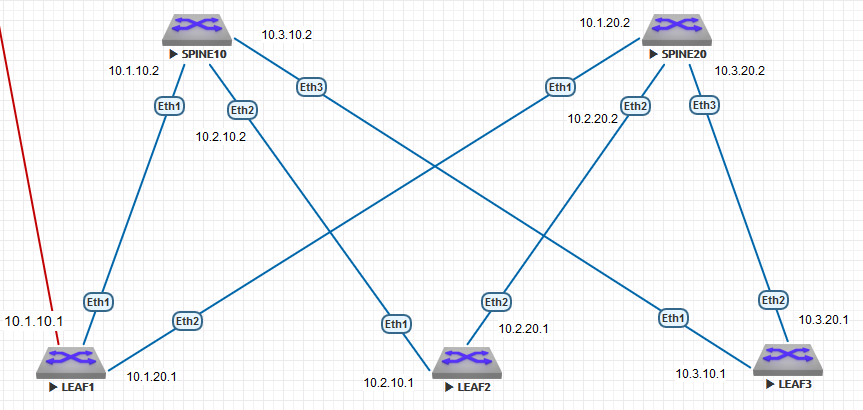

### Соединительные сети для iBGP:
10.1.10.0/30

10.2.10.0/30

10.3.10.0/30

10.1.20.0/30

10.2.20.0/30

10.3.20.0/30




### КОНФИГУРАЦИИ ОБОРУДОВАНИЯ:

#### LEAF1:
```
leaf1#show runn
! Command: show running-config
! device: leaf1 (vEOS-lab, EOS-4.29.2F)
!
! boot system flash:/vEOS-lab.swi
!
no aaa root
!
transceiver qsfp default-mode 4x10G
!
service routing protocols model ribd
!
hostname leaf1
!
spanning-tree mode mstp
!
interface Ethernet1
   no switchport
   ip address 10.1.10.1/30
!
interface Ethernet2
   no switchport
   ip address 10.1.20.1/30
!
interface Ethernet3
!
interface Ethernet4
!
interface Ethernet5
!
interface Ethernet6
!
interface Ethernet7
!
interface Ethernet8
!
interface Management1
!
ip routing
!
router bgp 66000
   neighbor 10.1.10.2 remote-as 66000
   neighbor 10.1.20.2 remote-as 66000
   !
   address-family ipv4
      neighbor 10.1.10.2 activate
      neighbor 10.1.20.2 activate
!
end

```

#### LEAF2:
```
leaf2#show runn
! Command: show running-config
! device: leaf2 (vEOS-lab, EOS-4.29.2F)
!
! boot system flash:/vEOS-lab.swi
!
no aaa root
!
transceiver qsfp default-mode 4x10G
!
service routing protocols model ribd
!
hostname leaf2
!
spanning-tree mode mstp
!
interface Ethernet1
   no switchport
   ip address 10.2.10.1/30
!
interface Ethernet2
   no switchport
   ip address 10.2.20.1/30
!
interface Ethernet3
!
interface Ethernet4
!
interface Ethernet5
!
interface Ethernet6
!
interface Ethernet7
!
interface Ethernet8
!
interface Management1
!
ip routing
!
router bgp 66000
   neighbor 10.2.10.2 remote-as 66000
   neighbor 10.2.20.2 remote-as 66000
   !
   address-family ipv4
      neighbor 10.2.10.2 activate
      neighbor 10.2.20.2 activate
!
end

```

#### LEAF3:
```
leaf3#show runn
! Command: show running-config
! device: leaf3 (vEOS-lab, EOS-4.29.2F)
!
! boot system flash:/vEOS-lab.swi
!
no aaa root
!
transceiver qsfp default-mode 4x10G
!
service routing protocols model ribd
!
hostname leaf3
!
spanning-tree mode mstp
!
interface Ethernet1
   no switchport
   ip address 10.3.10.1/30
!
interface Ethernet2
   no switchport
   ip address 10.3.20.1/30
!
interface Ethernet3
!
interface Ethernet4
!
interface Ethernet5
!
interface Ethernet6
!
interface Ethernet7
!
interface Ethernet8
!
interface Management1
!
ip routing
!
router bgp 66000
   neighbor 10.3.10.2 remote-as 66000
   neighbor 10.3.20.2 remote-as 66000
   !
   address-family ipv4
      neighbor 10.3.10.2 activate
      neighbor 10.3.20.2 activate
!
end

```

#### SPINE10:
```
spine10#show runn
! Command: show running-config
! device: spine10 (vEOS-lab, EOS-4.29.2F)
!
! boot system flash:/vEOS-lab.swi
!
no aaa root
!
transceiver qsfp default-mode 4x10G
!
service routing protocols model ribd
!
hostname spine10
!
spanning-tree mode mstp
!
interface Ethernet1
   no switchport
   ip address 10.1.10.2/30
!
interface Ethernet2
   no switchport
   ip address 10.2.10.2/30
!
interface Ethernet3
   no switchport
   ip address 10.3.10.2/30
!
interface Ethernet4
!
interface Ethernet5
!
interface Ethernet6
!
interface Ethernet7
!
interface Ethernet8
!
interface Loopback0
   ip address 2.2.2.2/32
!
interface Management1
!
ip routing
!
router bgp 66000
   neighbor 10.1.10.1 remote-as 66000
   neighbor 10.2.10.1 remote-as 66000
   neighbor 10.3.10.1 remote-as 66000
   !
   address-family ipv4
      neighbor 10.1.10.1 activate
      neighbor 10.2.10.1 activate
      neighbor 10.3.10.1 activate
!
end

```

#### SPINE20:
```
spine20#show runn
! Command: show running-config
! device: spine20 (vEOS-lab, EOS-4.29.2F)
!
! boot system flash:/vEOS-lab.swi
!
no aaa root
!
transceiver qsfp default-mode 4x10G
!
service routing protocols model ribd
!
hostname spine20
!
spanning-tree mode mstp
!
interface Ethernet1
   no switchport
   ip address 10.1.20.2/30
!
interface Ethernet2
   no switchport
   ip address 10.2.20.2/30
!
interface Ethernet3
   no switchport
   ip address 10.3.20.2/30
!
interface Ethernet4
!
interface Ethernet5
!
interface Ethernet6
!
interface Ethernet7
!
interface Ethernet8
!
interface Management1
!
ip routing
!
router bgp 66000
   neighbor 10.1.20.1 remote-as 66000
   neighbor 10.2.20.1 remote-as 66000
   neighbor 10.3.20.1 remote-as 66000
   !
   address-family ipv4
      neighbor 10.1.20.1 activate
      neighbor 10.2.20.1 activate
      neighbor 10.3.20.1 activate
!
end

```


