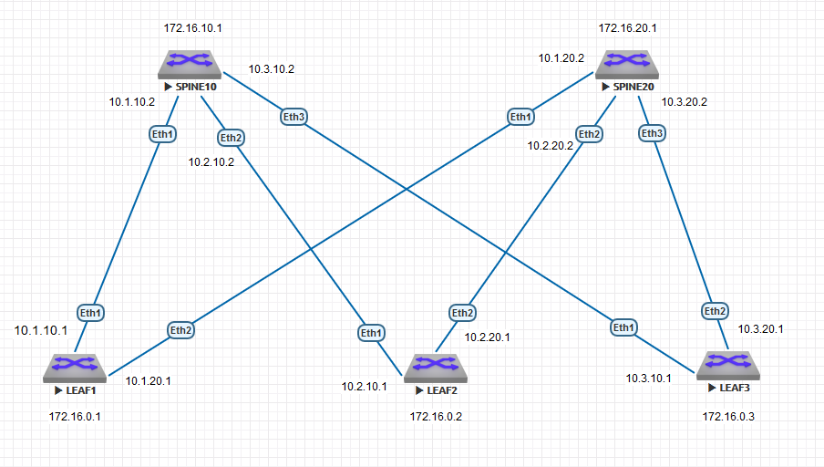

### Соединительные сети для ISIS:
10.1.10.0/30

10.2.10.0/30

10.3.10.0/30

10.1.20.0/30

10.2.20.0/30

10.3.20.0/30




### КОНФИГУРАЦИИ ОБОРУДОВАНИЯ:

#### LEAF1:
```
leaf1#show runn
! Command: show running-config
! device: leaf1 (vEOS-lab, EOS-4.29.2F)
!
! boot system flash:/vEOS-lab.swi
!
no aaa root
!
transceiver qsfp default-mode 4x10G
!
service routing protocols model ribd
!
hostname leaf1
!
spanning-tree mode mstp
!
interface Ethernet1
   no switchport
   ip address 10.1.10.1/30
   isis enable UNDERLAY
   isis circuit-type level-1
   isis network point-to-point
!
interface Ethernet2
   no switchport
   ip address 10.1.20.1/30
   isis enable UNDERLAY
   isis circuit-type level-1
   isis network point-to-point
!
interface Ethernet3
   isis passive
!
interface Ethernet4
   isis passive
!
interface Ethernet5
   isis passive
!
interface Ethernet6
   isis passive
!
interface Ethernet7
   isis passive
!
interface Ethernet8
   isis passive
!
interface Loopback0
   ip address 172.16.0.1/32
   isis enable UNDERLAY
   isis passive
!
interface Management1
!
ip routing
!
router isis UNDERLAY
   net 49.0001.0172.0016.0000.0001.00
   router-id ipv4 172.16.0.1
   is-type level-1
   log-adjacency-changes
   !
   address-family ipv4 unicast
!
end

```

#### LEAF2:
```
leaf2#show runn
! Command: show running-config
! device: leaf2 (vEOS-lab, EOS-4.29.2F)
!
! boot system flash:/vEOS-lab.swi
!
no aaa root
!
transceiver qsfp default-mode 4x10G
!
service routing protocols model ribd
!
hostname leaf2
!
spanning-tree mode mstp
!
interface Ethernet1
   no switchport
   ip address 10.2.10.1/30
   isis enable UNDERLAY
   isis circuit-type level-1
   isis network point-to-point
!
interface Ethernet2
   no switchport
   ip address 10.2.20.1/30
   isis enable UNDERLAY
   isis circuit-type level-1
   isis network point-to-point
!
interface Ethernet3
   isis passive
!
interface Ethernet4
   isis passive
!
interface Ethernet5
   isis passive
!
interface Ethernet6
   isis passive
!
interface Ethernet7
   isis passive
!
interface Ethernet8
   isis passive
!
interface Loopback0
   ip address 172.16.0.2/32
   isis enable UNDERLAY
   isis passive
!
interface Management1
!
ip routing
!
router isis UNDERLAY
   net 49.0001.0172.0016.0000.0002.00
   router-id ipv4 172.16.0.2
   is-type level-1
   !
   address-family ipv4 unicast
!
end

```

#### LEAF3:
```
leaf3#show runn
! Command: show running-config
! device: leaf3 (vEOS-lab, EOS-4.29.2F)
!
! boot system flash:/vEOS-lab.swi
!
no aaa root
!
transceiver qsfp default-mode 4x10G
!
service routing protocols model ribd
!
hostname leaf3
!
spanning-tree mode mstp
!
interface Ethernet1
   no switchport
   ip address 10.3.10.1/30
   isis enable UNDERLAY
   isis circuit-type level-1
   isis network point-to-point
!
interface Ethernet2
   no switchport
   ip address 10.3.20.1/30
   isis enable UNDERLAY
   isis circuit-type level-1
   isis network point-to-point
!
interface Ethernet3
   isis passive
!
interface Ethernet4
   isis passive
!
interface Ethernet5
   isis passive
!
interface Ethernet6
   isis passive
!
interface Ethernet7
   isis passive
!
interface Ethernet8
   isis passive
!
interface Loopback0
   ip address 172.16.0.3/32
   isis enable UNDERLAY
   isis passive
!
interface Management1
!
ip routing
!
router isis UNDERLAY
   net 49.0001.0172.0016.0000.0003.00
   router-id ipv4 172.16.0.3
   is-type level-1
   !
   address-family ipv4 unicast
!
end

```

#### SPINE10:
```
spine10#show runn
! Command: show running-config
! device: spine10 (vEOS-lab, EOS-4.29.2F)
!
! boot system flash:/vEOS-lab.swi
!
no aaa root
!
transceiver qsfp default-mode 4x10G
!
service routing protocols model ribd
!
hostname spine10
!
spanning-tree mode mstp
!
interface Ethernet1
   no switchport
   ip address 10.1.10.2/30
   isis enable UNDERLAY
   isis circuit-type level-1
   isis network point-to-point
!
interface Ethernet2
   no switchport
   ip address 10.2.10.2/30
   isis enable UNDERLAY
   isis circuit-type level-1
   isis network point-to-point
!
interface Ethernet3
   no switchport
   ip address 10.3.10.2/30
   isis enable UNDERLAY
   isis circuit-type level-1
   isis network point-to-point
!
interface Ethernet4
   isis passive
!
interface Ethernet5
   isis passive
!
interface Ethernet6
   isis passive
!
interface Ethernet7
   isis passive
!
interface Ethernet8
   isis passive
!
interface Loopback0
   ip address 172.16.10.1/32
   isis enable UNDERLAY
   isis passive
!
interface Management1
!
ip routing
!
router isis UNDERLAY
   net 49.0001.0172.0016.0010.0001.00
   router-id ipv4 172.16.10.1
   is-type level-1
   log-adjacency-changes
   !
   address-family ipv4 unicast
!
end

```

#### SPINE20:
```
spine20#show runn
! Command: show running-config
! device: spine20 (vEOS-lab, EOS-4.29.2F)
!
! boot system flash:/vEOS-lab.swi
!
no aaa root
!
transceiver qsfp default-mode 4x10G
!
service routing protocols model ribd
!
hostname spine20
!
spanning-tree mode mstp
!
interface Ethernet1
   no switchport
   ip address 10.1.20.2/30
   isis enable UNDERLAY
   isis circuit-type level-1
   isis network point-to-point
!
interface Ethernet2
   no switchport
   ip address 10.2.20.2/30
   isis enable UNDERLAY
   isis circuit-type level-1
   isis network point-to-point
!
interface Ethernet3
   no switchport
   ip address 10.3.20.2/30
   isis enable UNDERLAY
   isis circuit-type level-1
   isis network point-to-point
!
interface Ethernet4
   isis passive
!
interface Ethernet5
   isis passive
!
interface Ethernet6
   isis passive
!
interface Ethernet7
   isis passive
!
interface Ethernet8
   isis passive
!
interface Loopback0
   ip address 172.16.20.1/32
   isis enable UNDERLAY
   isis passive
!
interface Management1
!
ip routing
!
router isis UNDERLAY
   net 49.0001.0172.0016.0020.0001.00
   router-id ipv4 172.16.20.1
   is-type level-1
   !
   address-family ipv4 unicast
!
end

```

### show isis neighbors

#### LEAF1
```
Instance  VRF      System Id        Type Interface          SNPA              State Hold time   Circuit Id
UNDERLAY  default  spine10          L1   Ethernet1          P2P               UP    28          0E
UNDERLAY  default  spine20          L1   Ethernet2          P2P               UP    28          0E
```
#### LEAF2
```
Instance  VRF      System Id        Type Interface          SNPA              State Hold time   Circuit Id
UNDERLAY  default  spine10          L1   Ethernet1          P2P               UP    23          0F
UNDERLAY  default  spine20          L1   Ethernet2          P2P               UP    27          0F
```
#### LEAF3
```
Instance  VRF      System Id        Type Interface          SNPA              State Hold time   Circuit Id
UNDERLAY  default  spine10          L1   Ethernet1          P2P               UP    27          10
UNDERLAY  default  spine20          L1   Ethernet2          P2P               UP    23          10
```
#### SPINE10
```
Instance  VRF      System Id        Type Interface          SNPA              State Hold time   Circuit Id
UNDERLAY  default  leaf1            L1   Ethernet1          P2P               UP    29          0E
UNDERLAY  default  leaf2            L1   Ethernet2          P2P               UP    24          0E
UNDERLAY  default  leaf3            L1   Ethernet3          P2P               UP    26          0E
```
#### SPINE20
```
Instance  VRF      System Id        Type Interface          SNPA              State Hold time   Circuit Id
UNDERLAY  default  leaf1            L1   Ethernet1          P2P               UP    24          0F
UNDERLAY  default  leaf2            L1   Ethernet2          P2P               UP    22          0F
UNDERLAY  default  leaf3            L1   Ethernet3          P2P               UP    27          0F
```

### show ip route isis

#### LEAF1
```
 I L1     10.2.10.0/30 [115/20] via 10.1.10.2, Ethernet1
 I L1     10.2.20.0/30 [115/20] via 10.1.20.2, Ethernet2
 I L1     10.3.10.0/30 [115/20] via 10.1.10.2, Ethernet1
 I L1     10.3.20.0/30 [115/20] via 10.1.20.2, Ethernet2
 I L1     172.16.0.2/32 [115/30] via 10.1.10.2, Ethernet1
                                 via 10.1.20.2, Ethernet2
 I L1     172.16.0.3/32 [115/30] via 10.1.10.2, Ethernet1
                                 via 10.1.20.2, Ethernet2
 I L1     172.16.10.1/32 [115/20] via 10.1.10.2, Ethernet1
 I L1     172.16.20.1/32 [115/20] via 10.1.20.2, Ethernet2
```
#### LEAF2
```
 I L1     10.1.10.0/30 [115/20] via 10.2.10.2, Ethernet1
 I L1     10.1.20.0/30 [115/20] via 10.2.20.2, Ethernet2
 I L1     10.3.10.0/30 [115/20] via 10.2.10.2, Ethernet1
 I L1     10.3.20.0/30 [115/20] via 10.2.20.2, Ethernet2
 I L1     172.16.0.1/32 [115/30] via 10.2.10.2, Ethernet1
                                 via 10.2.20.2, Ethernet2
 I L1     172.16.0.3/32 [115/30] via 10.2.10.2, Ethernet1
                                 via 10.2.20.2, Ethernet2
 I L1     172.16.10.1/32 [115/20] via 10.2.10.2, Ethernet1
 I L1     172.16.20.1/32 [115/20] via 10.2.20.2, Ethernet2
```
#### LEAF3
```
 I L1     10.1.10.0/30 [115/20] via 10.3.10.2, Ethernet1
 I L1     10.1.20.0/30 [115/20] via 10.3.20.2, Ethernet2
 I L1     10.2.10.0/30 [115/20] via 10.3.10.2, Ethernet1
 I L1     10.2.20.0/30 [115/20] via 10.3.20.2, Ethernet2
 I L1     172.16.0.1/32 [115/30] via 10.3.10.2, Ethernet1
                                 via 10.3.20.2, Ethernet2
 I L1     172.16.0.2/32 [115/30] via 10.3.10.2, Ethernet1
                                 via 10.3.20.2, Ethernet2
 I L1     172.16.10.1/32 [115/20] via 10.3.10.2, Ethernet1
 I L1     172.16.20.1/32 [115/20] via 10.3.20.2, Ethernet2
```
#### SPINE10
```
 I L1     10.1.20.0/30 [115/20] via 10.1.10.1, Ethernet1
 I L1     10.2.20.0/30 [115/20] via 10.2.10.1, Ethernet2
 I L1     10.3.20.0/30 [115/20] via 10.3.10.1, Ethernet3
 I L1     172.16.0.1/32 [115/20] via 10.1.10.1, Ethernet1
 I L1     172.16.0.2/32 [115/20] via 10.2.10.1, Ethernet2
 I L1     172.16.0.3/32 [115/20] via 10.3.10.1, Ethernet3
 I L1     172.16.20.1/32 [115/30] via 10.1.10.1, Ethernet1
                                  via 10.2.10.1, Ethernet2
                                  via 10.3.10.1, Ethernet3
```
#### SPINE20
```
 I L1     10.1.10.0/30 [115/20] via 10.1.20.1, Ethernet1
 I L1     10.2.10.0/30 [115/20] via 10.2.20.1, Ethernet2
 I L1     10.3.10.0/30 [115/20] via 10.3.20.1, Ethernet3
 I L1     172.16.0.1/32 [115/20] via 10.1.20.1, Ethernet1
 I L1     172.16.0.2/32 [115/20] via 10.2.20.1, Ethernet2
 I L1     172.16.0.3/32 [115/20] via 10.3.20.1, Ethernet3
 I L1     172.16.10.1/32 [115/30] via 10.1.20.1, Ethernet1
                                  via 10.2.20.1, Ethernet2
                                  via 10.3.20.1, Ethernet3
```

### ping

#### ВСЕ УСТРОЙСТВА С LEAF1
```
leaf1#ping 172.16.10.1
PING 172.16.10.1 (172.16.10.1) 72(100) bytes of data.
80 bytes from 172.16.10.1: icmp_seq=1 ttl=64 time=11.2 ms
80 bytes from 172.16.10.1: icmp_seq=2 ttl=64 time=11.2 ms
80 bytes from 172.16.10.1: icmp_seq=3 ttl=64 time=7.83 ms
80 bytes from 172.16.10.1: icmp_seq=4 ttl=64 time=6.64 ms
80 bytes from 172.16.10.1: icmp_seq=5 ttl=64 time=7.39 ms

--- 172.16.10.1 ping statistics ---
5 packets transmitted, 5 received, 0% packet loss, time 53ms
rtt min/avg/max/mdev = 6.644/8.874/11.271/1.979 ms, ipg/ewma 13.328/9.948 ms
leaf1#ping 172.16.20.1
PING 172.16.20.1 (172.16.20.1) 72(100) bytes of data.
80 bytes from 172.16.20.1: icmp_seq=1 ttl=64 time=9.65 ms
80 bytes from 172.16.20.1: icmp_seq=2 ttl=64 time=6.89 ms
80 bytes from 172.16.20.1: icmp_seq=3 ttl=64 time=8.57 ms
80 bytes from 172.16.20.1: icmp_seq=4 ttl=64 time=7.48 ms
80 bytes from 172.16.20.1: icmp_seq=5 ttl=64 time=7.55 ms

--- 172.16.20.1 ping statistics ---
5 packets transmitted, 5 received, 0% packet loss, time 49ms
rtt min/avg/max/mdev = 6.897/8.032/9.656/0.979 ms, ipg/ewma 12.491/8.821 ms
leaf1#ping 172.16.0.2
PING 172.16.0.2 (172.16.0.2) 72(100) bytes of data.
80 bytes from 172.16.0.2: icmp_seq=1 ttl=63 time=27.3 ms
80 bytes from 172.16.0.2: icmp_seq=2 ttl=63 time=22.1 ms
80 bytes from 172.16.0.2: icmp_seq=3 ttl=63 time=17.2 ms
80 bytes from 172.16.0.2: icmp_seq=4 ttl=63 time=20.2 ms
80 bytes from 172.16.0.2: icmp_seq=5 ttl=63 time=29.5 ms

--- 172.16.0.2 ping statistics ---
5 packets transmitted, 5 received, 0% packet loss, time 79ms
rtt min/avg/max/mdev = 17.242/23.303/29.504/4.527 ms, pipe 3, ipg/ewma 19.962/25.461 ms
leaf1#ping 172.16.0.3
PING 172.16.0.3 (172.16.0.3) 72(100) bytes of data.
80 bytes from 172.16.0.3: icmp_seq=1 ttl=63 time=19.3 ms
80 bytes from 172.16.0.3: icmp_seq=2 ttl=63 time=24.2 ms
80 bytes from 172.16.0.3: icmp_seq=3 ttl=63 time=16.8 ms
80 bytes from 172.16.0.3: icmp_seq=4 ttl=63 time=15.3 ms
80 bytes from 172.16.0.3: icmp_seq=5 ttl=63 time=19.2 ms

--- 172.16.0.3 ping statistics ---
5 packets transmitted, 5 received, 0% packet loss, time 74ms
rtt min/avg/max/mdev = 15.388/19.031/24.295/3.029 ms, pipe 2, ipg/ewma 18.646/19.089 ms
```
