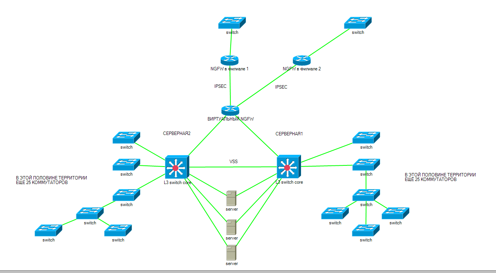
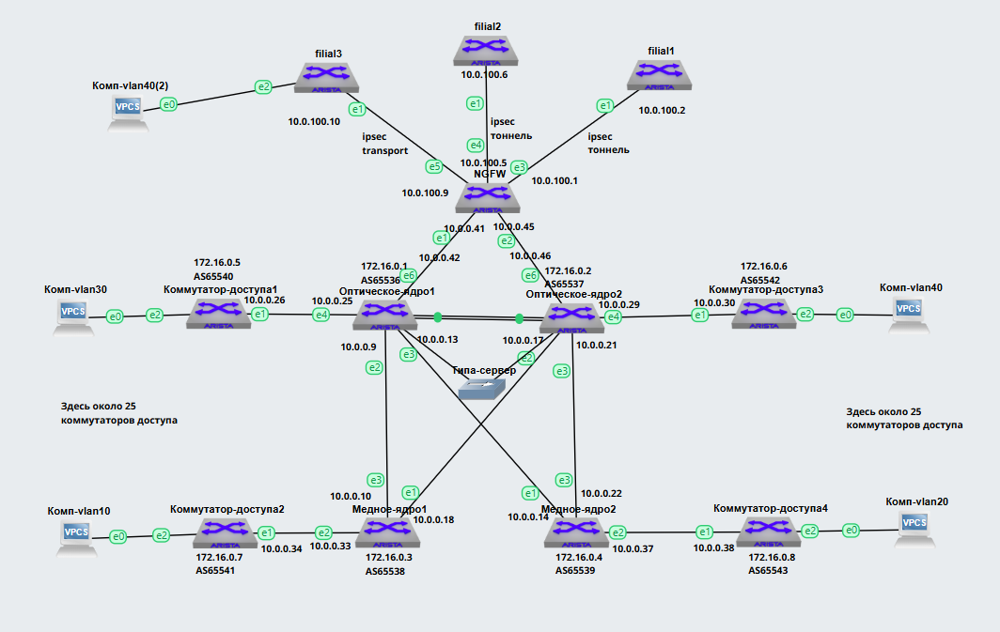

## Использование технологий, применяемых в ЦОД, для модернизации кампусной сети

#### Упрощённая схема текущей сети:

### Архитектура на сегодняшний день:

1. ИТ инфраструктура фирмы представлена в виде 2ух коммутаторов ядра сети с объединённым уровнем агрегации, работающих совместно по протоколу VSS расположенных в двух разных серверных

2. Имеется по всей территории фирмы около 50 коммутаторов доступа подключенных к ядру, а также 30 wi-fi точек

3. На всем этом сетевом оборудовании раскинуто 36шт VLAN (пользовательские, видеонаблюдение, серверные сети, гостевые, управления и т.д.)

4. Имеется 3 удаленных филиала подключенных по IPSEC. Обмен маршрутами происходит по протоколу OSPF.

5. Выход в сеть Интернет осуществляется через 2 провайдера по eBGP full-view

6. Устройством, осуществляющим выход в Интернет и подключением удалённых филиалов, является виртуальный NGFW расположенный на серверах фирмы

7. Имеется 10 серверов, подключаемых одновременно к двум коммутаторам ядра сети каждый

### Проблемы на сегодняшний день:

1. Большой L2 домен, что влечёт за собой огромное количество BUM трафика

2. Очевидные минусы технологии VSS на коммутаторах ядра сети

### Дополнительные задачи на сегодняшний день:

1. В связи со строительством третьего филиала, есть необходимость растягивания L2 домена между этим филиалом №3 и головным офисом для работы специализированного оборудования по диагностике грузового автотранспорта

### Попытка применить технологии построения ЦОД, для модернизации текущей сети и устранения проблем указанных выше.

#### Схема будущей сети:

#### Перечень и описание работ:

1. Ядро сети (правильней его назвать центральным узлом сети) будет состоять из 4-ёх L3 коммутаторов. Два коммутатора в серверной №1 и два в серверной №2.
2. В серверных есть серверы и СХД подключаемые по оптике, а также есть и старое оборудование, подключаемое по меди. Коммутаторы доступа по территории предприятия, есть которые подключаются к центральному узлу, как по меди, так и по оптике.
3. Для обеспечения отказоустойчивости центрального узла сети будет использована схема похожая на LEAF и SPINE применяемая в ЦОДах. 
Медные коммутаторы подключаются как LEAF: по линку до каждого SPINE. Между SPINE так же есть линк, так как много трафика будет ходить между этими SPINEами. По своей функциональности SPINE коммутаторы являются такими же LEAF коммутаторами.

4. Серверы и СХД подключаются либо к оптическим коммутаторам, либо к медным, в зависимости от типа разъемов на этих серверах.
5. Коммутаторы доступа подключаются к центральному узлу сети.
6. Подключение коммутаторов доступа происходит по одному линку. Так как здесь нет требования к 100% отказоустойчивости
7. Всё это дело настраивается как единая ip фабрика, но на ip фабрику, визуально, не сильно похоже.

8. К центральному узлу сети подключается виртуальный NGFW расположенный на одном из серверов (на схеме выглядит как физическое устройство).
9. NGFW выпускает в сеть Интернет головной офис, а так же устанавливает через IPSEC связь с Филиалом 1 и Филиалом 2.
Обмен маршрутной информацией между головным офисом и филиалами 1 и 2 происходит по протоколу OSPF. На оптических коммутаторах центрального узла сети происходит перекладывание маршрутов из OSPF в EVPN и обратно.

10. Для связи головного офиса и филиала 3 взята услуга L2 VPN от Интернет провайдера.
11. Филиал 3 подключается так же как 1 и 2. Но к нему есть требование растягивания одного из VLAN (vlan 40) между головным офисом и филиалом 3 для работы специализированного оборудования.
12. Для этого, помимо обмена маршрутами по OSPF, еще будем стыковать нашу "фабрику" с NGFW филиала №3 по EVPN.
13. Underlay между ними настроем статическими маршрутами, чтобы не грузить и так накрученный конфиг.
14. На стыке между NGFW и Оптическими коммутаторами ядра со стороны центрального узла настроены sub интерфейсы для того, чтобы Underlay адреса филиала №3 попали в VRF Underlay фабрики.

**Итог:**
Таблицы mac-адресов всех VLAN распространяются посредством EVPN
От широковещательного L2 домена ушли. Все коммутаторы доступа "стали" маршрутизаторами доступа
Межвлановая маршрутизация работает
Обмен маршрутами между филиалами и головным офисом выполняется
Один из VLAN растянут между головным офисом и филиалом №3
Количество bum трафика стало меньше
Маршрутная информация от филиалов, полученных по OSPF попадает в EVPN и обратно
Серверное оборудование подключено сразу к двум коммутаторам ядра, что дает отказоустойчивость на случай выхода из строя одного из коммутаторов ядра
Коммутаторы доступа не имеют резервирования, но такого требования в тех задании нет. Хотя, данная схема позволяет подключить коммутаторы доступа одновременно к двум коммутаторам ядра
Центральный узел сети заменили на псевдо-фабрику. Ушли от технологии VSS.

### Конфигурации оборудования:
#### Оптическое-ядро1
'''
optic-core1#show runn
! Command: show running-config
! device: optic-core1 (vEOS-lab, EOS-4.29.2F)
!
! boot system flash:/vEOS-lab.swi
!
no aaa root
!
transceiver qsfp default-mode 4x10G
!
service routing protocols model multi-agent
!
hostname optic-core1
!
spanning-tree mode mstp
!
vlan 10,20,30,40,111
!
vrf instance TENANT1
!
interface Ethernet1
   no switchport
   ip address 10.0.0.1/30
!
interface Ethernet2
   no switchport
   ip address 10.0.0.9/30
!
interface Ethernet3
   no switchport
   ip address 10.0.0.13/30
!
interface Ethernet4
   no switchport
   ip address 10.0.0.25/30
!
interface Ethernet5
   no switchport
   ip address 10.0.0.5/30
!
interface Ethernet6
   no switchport
   vrf TENANT1
   ip address 10.0.0.42/30
   ip ospf network point-to-point
   ip ospf area 0.0.0.0
!
interface Ethernet6.1
   encapsulation dot1q vlan 111
   ip address 10.0.200.1/30
!
interface Ethernet7
   switchport access vlan 40
   switchport trunk allowed vlan 40
!
interface Loopback0
   ip address 172.16.0.1/32
!
interface Management1
!
interface Vlan10
   vrf TENANT1
   ip address virtual 192.168.10.254/24
!
interface Vlan20
   vrf TENANT1
   ip address virtual 192.168.20.254/24
!
interface Vlan30
   vrf TENANT1
   ip address virtual 192.168.30.254/24
!
interface Vlan40
   vrf TENANT1
   ip address virtual 192.168.40.254/24
!
interface Vxlan1
   vxlan source-interface Loopback0
   vxlan udp-port 4789
   vxlan vlan 10 vni 1010
   vxlan vlan 20 vni 1020
   vxlan vlan 30 vni 1030
   vxlan vlan 40 vni 1040
   vxlan vrf TENANT1 vni 5000
!
ip virtual-router mac-address 00:00:00:00:00:01
!
ip routing
ip routing vrf TENANT1
!
ip prefix-list qwerty-list
   seq 10 permit 8.8.8.8/32
!
ip route 172.16.100.1/32 10.0.200.2
!
route-map qwerty permit 10
   match ip address prefix-list qwerty-list
!
router bgp 65536
   router-id 172.16.0.1
   neighbor 10.0.0.2 remote-as 65537
   neighbor 10.0.0.6 remote-as 65537
   neighbor 10.0.0.10 remote-as 65538
   neighbor 10.0.0.14 remote-as 65539
   neighbor 10.0.0.26 remote-as 65540
   neighbor 172.16.0.2 remote-as 65537
   neighbor 172.16.0.2 update-source Loopback0
   neighbor 172.16.0.2 ebgp-multihop 2
   neighbor 172.16.0.2 send-community extended
   neighbor 172.16.0.3 remote-as 65538
   neighbor 172.16.0.3 update-source Loopback0
   neighbor 172.16.0.3 ebgp-multihop 2
   neighbor 172.16.0.3 send-community extended
   neighbor 172.16.0.4 remote-as 65539
   neighbor 172.16.0.4 update-source Loopback0
   neighbor 172.16.0.4 ebgp-multihop 2
   neighbor 172.16.0.4 send-community extended
   neighbor 172.16.0.5 remote-as 65540
   neighbor 172.16.0.5 update-source Loopback0
   neighbor 172.16.0.5 ebgp-multihop 2
   neighbor 172.16.0.5 send-community extended
   neighbor 172.16.100.1 remote-as 65600
   neighbor 172.16.100.1 update-source Loopback0
   neighbor 172.16.100.1 ebgp-multihop 2
   neighbor 172.16.100.1 send-community extended
   !
   vlan 10
      rd 65000:10
      route-target both 65000:10
      redistribute learned
   !
   vlan 20
      rd 65000:20
      route-target both 65000:20
      redistribute learned
   !
   vlan 30
      rd 65000:30
      route-target both 65000:30
      redistribute learned
   !
   vlan 40
      rd 65000:40
      route-target both 65000:40
      redistribute learned
   !
   address-family evpn
      neighbor 172.16.0.2 activate
      neighbor 172.16.0.3 activate
      neighbor 172.16.0.4 activate
      neighbor 172.16.0.5 activate
      neighbor 172.16.100.1 activate
   !
   address-family ipv4
      neighbor 10.0.0.2 activate
      neighbor 10.0.0.6 activate
      neighbor 10.0.0.10 activate
      neighbor 10.0.0.14 activate
      neighbor 10.0.0.26 activate
      network 10.0.0.0/30
      network 10.0.0.4/30
      network 10.0.0.8/30
      network 10.0.0.12/30
      network 172.16.0.1/32
   !
   vrf TENANT1
      rd 65000:5000
      route-target import evpn 65000:5000
      route-target export evpn 65000:5000
      redistribute ospf
!
router ospf 1 vrf TENANT1
   passive-interface default
   no passive-interface Ethernet6
   redistribute bgp
   max-lsa 12000
!
end
'''

#### Оптическое-ядро2
'''
optic-core2#show runn
! Command: show running-config
! device: optic-core2 (vEOS-lab, EOS-4.29.2F)
!
! boot system flash:/vEOS-lab.swi
!
no aaa root
!
transceiver qsfp default-mode 4x10G
!
service routing protocols model multi-agent
!
hostname optic-core2
!
spanning-tree mode mstp
!
vlan 10,20,30,40
!
vrf instance TENANT1
!
interface Ethernet1
   no switchport
   ip address 10.0.0.2/30
!
interface Ethernet2
   no switchport
   ip address 10.0.0.17/30
!
interface Ethernet3
   no switchport
   ip address 10.0.0.21/30
!
interface Ethernet4
   no switchport
   ip address 10.0.0.29/30
!
interface Ethernet5
   no switchport
   ip address 10.0.0.6/30
!
interface Ethernet6
   no switchport
   vrf TENANT1
   ip address 10.0.0.46/30
   ip ospf network point-to-point
   ip ospf area 0.0.0.0
!
interface Ethernet7
!
interface Loopback0
   ip address 172.16.0.2/32
!
interface Management1
!
interface Vlan10
   vrf TENANT1
   ip address virtual 192.168.10.254/24
!
interface Vlan20
   vrf TENANT1
   ip address virtual 192.168.20.254/24
!
interface Vlan30
   vrf TENANT1
   ip address virtual 192.168.30.254/24
!
interface Vlan40
   vrf TENANT1
   ip address virtual 192.168.40.254/24
!
interface Vxlan1
   vxlan source-interface Loopback0
   vxlan udp-port 4789
   vxlan vlan 10 vni 1010
   vxlan vlan 20 vni 1020
   vxlan vlan 30 vni 1030
   vxlan vlan 40 vni 1040
   vxlan vrf TENANT1 vni 5000
!
ip virtual-router mac-address 00:00:00:00:00:01
!
ip routing
ip routing vrf TENANT1
!
router bgp 65537
   router-id 172.16.0.2
   neighbor 10.0.0.1 remote-as 65536
   neighbor 10.0.0.5 remote-as 65536
   neighbor 10.0.0.18 remote-as 65538
   neighbor 10.0.0.22 remote-as 65539
   neighbor 10.0.0.30 remote-as 65542
   neighbor 172.16.0.1 remote-as 65536
   neighbor 172.16.0.1 update-source Loopback0
   neighbor 172.16.0.1 ebgp-multihop 2
   neighbor 172.16.0.1 send-community extended
   neighbor 172.16.0.3 remote-as 65538
   neighbor 172.16.0.3 update-source Loopback0
   neighbor 172.16.0.3 ebgp-multihop 2
   neighbor 172.16.0.3 send-community extended
   neighbor 172.16.0.4 remote-as 65539
   neighbor 172.16.0.4 update-source Loopback0
   neighbor 172.16.0.4 ebgp-multihop 2
   neighbor 172.16.0.4 send-community extended
   neighbor 172.16.0.6 remote-as 65542
   neighbor 172.16.0.6 update-source Loopback0
   neighbor 172.16.0.6 ebgp-multihop 2
   neighbor 172.16.0.6 send-community extended
   !
   vlan 10
      rd 65000:10
      route-target both 65000:10
      redistribute learned
   !
   vlan 20
      rd 65000:20
      route-target both 65000:20
      redistribute learned
   !
   vlan 30
      rd 65000:30
      route-target both 65000:30
      redistribute learned
   !
   vlan 40
      rd 65000:40
      route-target both 65000:40
      redistribute learned
   !
   address-family evpn
      neighbor 172.16.0.1 activate
      neighbor 172.16.0.3 activate
      neighbor 172.16.0.4 activate
      neighbor 172.16.0.6 activate
   !
   address-family ipv4
      neighbor 10.0.0.1 activate
      neighbor 10.0.0.5 activate
      neighbor 10.0.0.18 activate
      neighbor 10.0.0.22 activate
      neighbor 10.0.0.30 activate
      network 10.0.0.0/30
      network 10.0.0.4/30
      network 10.0.0.16/30
      network 10.0.0.20/30
      network 172.16.0.2/32
   !
   vrf TENANT1
      rd 65000:5000
      route-target import evpn 65000:5000
      route-target export evpn 65000:5000
      redistribute ospf
!
router ospf 1 vrf TENANT1
   passive-interface default
   no passive-interface Ethernet6
   max-lsa 12000
!
end
'''

#### Медное-ядро1
'''
copper-core1#show runn
! Command: show running-config
! device: copper-core1 (vEOS-lab, EOS-4.29.2F)
!
! boot system flash:/vEOS-lab.swi
!
no aaa root
!
transceiver qsfp default-mode 4x10G
!
service routing protocols model multi-agent
!
hostname copper-core1
!
spanning-tree mode mstp
!
vlan 10,20,30,40
!
vrf instance TENANT1
!
interface Ethernet1
   no switchport
   ip address 10.0.0.18/30
!
interface Ethernet2
   no switchport
   ip address 10.0.0.33/30
!
interface Ethernet3
   no switchport
   ip address 10.0.0.10/30
!
interface Ethernet4
   switchport access vlan 20
!
interface Ethernet5
!
interface Ethernet6
!
interface Ethernet7
!
interface Loopback0
   ip address 172.16.0.3/32
!
interface Management1
!
interface Vlan10
   vrf TENANT1
   ip address virtual 192.168.10.254/24
!
interface Vlan20
   vrf TENANT1
   ip address virtual 192.168.20.254/24
!
interface Vlan30
   vrf TENANT1
   ip address virtual 192.168.30.254/24
!
interface Vlan40
   vrf TENANT1
   ip address virtual 192.168.40.254/24
!
interface Vxlan1
   vxlan source-interface Loopback0
   vxlan udp-port 4789
   vxlan vlan 10 vni 1010
   vxlan vlan 20 vni 1020
   vxlan vlan 30 vni 1030
   vxlan vlan 40 vni 1040
   vxlan vrf TENANT1 vni 5000
!
ip virtual-router mac-address 00:00:00:00:00:01
!
ip routing
ip routing vrf TENANT1
!
router bgp 65538
   router-id 172.16.0.3
   neighbor 10.0.0.9 remote-as 65536
   neighbor 10.0.0.17 remote-as 65537
   neighbor 10.0.0.34 remote-as 65541
   neighbor 172.16.0.1 remote-as 65536
   neighbor 172.16.0.1 update-source Loopback0
   neighbor 172.16.0.1 ebgp-multihop 2
   neighbor 172.16.0.1 send-community extended
   neighbor 172.16.0.2 remote-as 65537
   neighbor 172.16.0.2 update-source Loopback0
   neighbor 172.16.0.2 ebgp-multihop 2
   neighbor 172.16.0.2 send-community extended
   neighbor 172.16.0.7 remote-as 65541
   neighbor 172.16.0.7 update-source Loopback0
   neighbor 172.16.0.7 ebgp-multihop 2
   neighbor 172.16.0.7 send-community extended
   !
   vlan 10
      rd 65000:10
      route-target both 65000:10
      redistribute learned
   !
   vlan 20
      rd 65000:20
      route-target both 65000:20
      redistribute learned
   !
   vlan 30
      rd 65000:30
      route-target both 65000:30
      redistribute learned
   !
   vlan 40
      rd 65000:40
      route-target both 65000:40
      redistribute learned
   !
   address-family evpn
      neighbor 172.16.0.1 activate
      neighbor 172.16.0.2 activate
      neighbor 172.16.0.7 activate
   !
   address-family ipv4
      neighbor 10.0.0.9 activate
      neighbor 10.0.0.17 activate
      neighbor 10.0.0.34 activate
      network 10.0.0.8/30
      network 10.0.0.16/30
      network 172.16.0.3/32
   !
   vrf TENANT1
      rd 65000:5000
      route-target import evpn 65000:5000
      route-target export evpn 65000:5000
!
end
'''

#### Медное-ядро2
'''
copper-core2#show runn
! Command: show running-config
! device: copper-core2 (vEOS-lab, EOS-4.29.2F)
!
! boot system flash:/vEOS-lab.swi
!
no aaa root
!
transceiver qsfp default-mode 4x10G
!
service routing protocols model multi-agent
!
hostname copper-core2
!
spanning-tree mode mstp
!
vlan 10,20,30,40
!
vrf instance TENANT1
!
interface Ethernet1
   no switchport
   ip address 10.0.0.14/30
!
interface Ethernet2
   no switchport
   ip address 10.0.0.37/30
!
interface Ethernet3
   no switchport
   ip address 10.0.0.22/30
!
interface Ethernet4
   switchport access vlan 10
!
interface Ethernet5
!
interface Ethernet6
!
interface Ethernet7
!
interface Loopback0
   ip address 172.16.0.4/32
!
interface Management1
!
interface Vlan10
   vrf TENANT1
   ip address virtual 192.168.10.254/24
!
interface Vlan20
   vrf TENANT1
   ip address virtual 192.168.20.254/24
!
interface Vlan30
   vrf TENANT1
   ip address virtual 192.168.30.254/24
!
interface Vlan40
   vrf TENANT1
   ip address virtual 192.168.40.254/24
!
interface Vxlan1
   vxlan source-interface Loopback0
   vxlan udp-port 4789
   vxlan vlan 10 vni 1010
   vxlan vlan 20 vni 1020
   vxlan vlan 30 vni 1030
   vxlan vlan 40 vni 1040
   vxlan vrf TENANT1 vni 5000
!
ip virtual-router mac-address 00:00:00:00:00:01
!
ip routing
ip routing vrf TENANT1
!
router bgp 65539
   router-id 172.16.0.4
   neighbor 10.0.0.13 remote-as 65536
   neighbor 10.0.0.21 remote-as 65537
   neighbor 10.0.0.38 remote-as 65543
   neighbor 172.16.0.1 remote-as 65536
   neighbor 172.16.0.1 update-source Loopback0
   neighbor 172.16.0.1 ebgp-multihop 2
   neighbor 172.16.0.1 send-community extended
   neighbor 172.16.0.2 remote-as 65537
   neighbor 172.16.0.2 update-source Loopback0
   neighbor 172.16.0.2 ebgp-multihop 2
   neighbor 172.16.0.2 send-community extended
   neighbor 172.16.0.8 remote-as 65543
   neighbor 172.16.0.8 update-source Loopback0
   neighbor 172.16.0.8 ebgp-multihop 2
   neighbor 172.16.0.8 send-community extended
   !
   vlan 10
      rd 65000:10
      route-target both 65000:10
      redistribute learned
   !
   vlan 20
      rd 65000:20
      route-target both 65000:20
      redistribute learned
   !
   vlan 30
      rd 65000:30
      route-target both 65000:30
      redistribute learned
   !
   vlan 40
      rd 65000:40
      route-target both 65000:40
      redistribute learned
   !
   address-family evpn
      neighbor 172.16.0.1 activate
      neighbor 172.16.0.2 activate
      neighbor 172.16.0.8 activate
   !
   address-family ipv4
      neighbor 10.0.0.13 activate
      neighbor 10.0.0.21 activate
      neighbor 10.0.0.38 activate
      network 10.0.0.12/30
      network 10.0.0.20/30
      network 172.16.0.4/32
   !
   vrf TENANT1
      rd 65000:5000
      route-target import evpn 65000:5000
      route-target export evpn 65000:5000
!
end
'''

#### Коммутатор-доступа1
'''
switch1#show runn
! Command: show running-config
! device: switch1 (vEOS-lab, EOS-4.29.2F)
!
! boot system flash:/vEOS-lab.swi
!
no aaa root
!
transceiver qsfp default-mode 4x10G
!
service routing protocols model multi-agent
!
hostname switch1
!
spanning-tree mode mstp
!
vlan 10,20,30,40
!
vrf instance TENANT1
!
interface Ethernet1
   no switchport
   ip address 10.0.0.26/30
!
interface Ethernet2
   switchport access vlan 30
!
interface Ethernet3
!
interface Ethernet4
!
interface Ethernet5
!
interface Ethernet6
!
interface Ethernet7
!
interface Loopback0
   ip address 172.16.0.5/32
!
interface Management1
!
interface Vlan10
   vrf TENANT1
   ip address virtual 192.168.10.254/24
!
interface Vlan20
   vrf TENANT1
   ip address virtual 192.168.20.254/24
!
interface Vlan30
   vrf TENANT1
   ip address virtual 192.168.30.254/24
!
interface Vlan40
   vrf TENANT1
   ip address virtual 192.168.40.254/24
!
interface Vxlan1
   vxlan source-interface Loopback0
   vxlan udp-port 4789
   vxlan vlan 10 vni 1010
   vxlan vlan 20 vni 1020
   vxlan vlan 30 vni 1030
   vxlan vlan 40 vni 1040
   vxlan vrf TENANT1 vni 5000
!
ip virtual-router mac-address 00:00:00:00:00:01
!
ip routing
ip routing vrf TENANT1
!
router bgp 65540
   router-id 172.16.0.5
   neighbor 10.0.0.25 remote-as 65536
   neighbor 172.16.0.1 remote-as 65536
   neighbor 172.16.0.1 update-source Loopback0
   neighbor 172.16.0.1 ebgp-multihop 2
   neighbor 172.16.0.1 send-community extended
   !
   vlan 10
      rd 65000:10
      route-target both 65000:10
      redistribute learned
   !
   vlan 20
      rd 65000:20
      route-target both 65000:20
      redistribute learned
   !
   vlan 30
      rd 65000:30
      route-target both 65000:30
      redistribute learned
   !
   vlan 40
      rd 65000:40
      route-target both 65000:40
      redistribute learned
   !
   address-family evpn
      neighbor 172.16.0.1 activate
   !
   address-family ipv4
      neighbor 10.0.0.25 activate
      network 10.0.0.24/30
      network 172.16.0.5/32
   !
   vrf TENANT1
      rd 65000:5000
      route-target import evpn 65000:5000
      route-target export evpn 65000:5000
!
end
'''

#### Коммутатор-доступа2
'''
switch2#show runn
! Command: show running-config
! device: switch2 (vEOS-lab, EOS-4.29.2F)
!
! boot system flash:/vEOS-lab.swi
!
no aaa root
!
transceiver qsfp default-mode 4x10G
!
service routing protocols model multi-agent
!
hostname switch2
!
spanning-tree mode mstp
!
vlan 10,20,30,40
!
vrf instance TENANT1
!
interface Ethernet1
   no switchport
   ip address 10.0.0.34/30
!
interface Ethernet2
   switchport access vlan 10
!
interface Ethernet3
!
interface Ethernet4
!
interface Ethernet5
!
interface Ethernet6
!
interface Ethernet7
!
interface Loopback0
   ip address 172.16.0.7/32
!
interface Management1
!
interface Vlan10
   vrf TENANT1
   ip address virtual 192.168.10.254/24
!
interface Vlan20
   vrf TENANT1
   ip address virtual 192.168.20.254/24
!
interface Vlan30
   vrf TENANT1
   ip address virtual 192.168.30.254/24
!
interface Vlan40
   vrf TENANT1
   ip address virtual 192.168.40.254/24
!
interface Vxlan1
   vxlan source-interface Loopback0
   vxlan udp-port 4789
   vxlan vlan 10 vni 1010
   vxlan vlan 20 vni 1020
   vxlan vlan 30 vni 1030
   vxlan vlan 40 vni 1040
   vxlan vrf TENANT1 vni 5000
!
ip virtual-router mac-address 00:00:00:00:00:01
!
ip routing
ip routing vrf TENANT1
!
router bgp 65541
   router-id 172.16.0.7
   neighbor 10.0.0.33 remote-as 65538
   neighbor 172.16.0.3 remote-as 65538
   neighbor 172.16.0.3 update-source Loopback0
   neighbor 172.16.0.3 ebgp-multihop 2
   neighbor 172.16.0.3 send-community extended
   !
   vlan 10
      rd 65000:10
      route-target both 65000:10
      redistribute learned
   !
   vlan 20
      rd 65000:20
      route-target both 65000:20
      redistribute learned
   !
   vlan 30
      rd 65000:30
      route-target both 65000:30
      redistribute learned
   !
   vlan 40
      rd 65000:40
      route-target both 65000:40
      redistribute learned
   !
   address-family evpn
      neighbor 172.16.0.3 activate
   !
   address-family ipv4
      neighbor 10.0.0.33 activate
      network 10.0.0.32/30
      network 172.16.0.7/32
   !
   vrf TENANT1
      rd 65000:5000
      route-target import evpn 65000:5000
      route-target export evpn 65000:5000
!
end
'''

#### Коммутатор-доступа3
'''
switch3#show runn
! Command: show running-config
! device: switch3 (vEOS-lab, EOS-4.29.2F)
!
! boot system flash:/vEOS-lab.swi
!
no aaa root
!
transceiver qsfp default-mode 4x10G
!
service routing protocols model multi-agent
!
hostname switch3
!
spanning-tree mode mstp
!
vlan 10,20,30,40
!
vrf instance TENANT1
!
interface Ethernet1
   no switchport
   ip address 10.0.0.30/30
!
interface Ethernet2
   switchport access vlan 40
!
interface Ethernet3
!
interface Ethernet4
!
interface Ethernet5
!
interface Ethernet6
!
interface Ethernet7
!
interface Loopback0
   ip address 172.16.0.6/32
!
interface Management1
!
interface Vlan10
   vrf TENANT1
   ip address virtual 192.168.10.254/24
!
interface Vlan20
   vrf TENANT1
   ip address virtual 192.168.20.254/24
!
interface Vlan30
   vrf TENANT1
   ip address virtual 192.168.30.254/24
!
interface Vlan40
   vrf TENANT1
   ip address virtual 192.168.40.254/24
!
interface Vxlan1
   vxlan source-interface Loopback0
   vxlan udp-port 4789
   vxlan vlan 10 vni 1010
   vxlan vlan 20 vni 1020
   vxlan vlan 30 vni 1030
   vxlan vlan 40 vni 1040
   vxlan vrf TENANT1 vni 5000
!
ip virtual-router mac-address 00:00:00:00:00:01
!
ip routing
ip routing vrf TENANT1
!
router bgp 65542
   router-id 172.16.0.6
   neighbor 10.0.0.29 remote-as 65537
   neighbor 172.16.0.2 remote-as 65537
   neighbor 172.16.0.2 update-source Loopback0
   neighbor 172.16.0.2 ebgp-multihop 2
   neighbor 172.16.0.2 send-community extended
   !
   vlan 10
      rd 65000:10
      route-target both 65000:10
      redistribute learned
   !
   vlan 20
      rd 65000:20
      route-target both 65000:20
      redistribute learned
   !
   vlan 30
      rd 65000:30
      route-target both 65000:30
      redistribute learned
   !
   vlan 40
      rd 65000:40
      route-target both 65000:40
      redistribute learned
   !
   address-family evpn
      neighbor 172.16.0.2 activate
   !
   address-family ipv4
      neighbor 10.0.0.29 activate
      network 10.0.0.28/30
      network 172.16.0.6/32
   !
   vrf TENANT1
      rd 65000:5000
      route-target import evpn 65000:5000
      route-target export evpn 65000:5000
!
end
'''

#### Коммутатор-доступа4
'''
switch4#show runn
! Command: show running-config
! device: switch4 (vEOS-lab, EOS-4.29.2F)
!
! boot system flash:/vEOS-lab.swi
!
no aaa root
!
transceiver qsfp default-mode 4x10G
!
service routing protocols model multi-agent
!
hostname switch4
!
spanning-tree mode mstp
!
vlan 10,20,30,40
!
vrf instance TENANT1
!
interface Ethernet1
   no switchport
   ip address 10.0.0.38/30
!
interface Ethernet2
   switchport access vlan 20
!
interface Ethernet3
!
interface Ethernet4
!
interface Ethernet5
!
interface Ethernet6
!
interface Ethernet7
!
interface Loopback0
   ip address 172.16.0.8/32
!
interface Management1
!
interface Vlan10
   vrf TENANT1
   ip address virtual 192.168.10.254/24
!
interface Vlan20
   vrf TENANT1
   ip address virtual 192.168.20.254/24
!
interface Vlan30
   vrf TENANT1
   ip address virtual 192.168.30.254/24
!
interface Vlan40
   vrf TENANT1
   ip address virtual 192.168.40.254/24
!
interface Vxlan1
   vxlan source-interface Loopback0
   vxlan udp-port 4789
   vxlan vlan 10 vni 1010
   vxlan vlan 20 vni 1020
   vxlan vlan 30 vni 1030
   vxlan vlan 40 vni 1040
   vxlan vrf TENANT1 vni 5000
!
ip virtual-router mac-address 00:00:00:00:00:01
!
ip routing
ip routing vrf TENANT1
!
router bgp 65543
   router-id 172.16.0.8
   neighbor 10.0.0.37 remote-as 65539
   neighbor 172.16.0.4 remote-as 65539
   neighbor 172.16.0.4 update-source Loopback0
   neighbor 172.16.0.4 ebgp-multihop 2
   neighbor 172.16.0.4 send-community extended
   !
   vlan 10
      rd 65000:10
      route-target both 65000:10
      redistribute learned
   !
   vlan 20
      rd 65000:20
      route-target both 65000:20
      redistribute learned
   !
   vlan 30
      rd 65000:30
      route-target both 65000:30
      redistribute learned
   !
   vlan 40
      rd 65000:40
      route-target both 65000:40
      redistribute learned
   !
   address-family evpn
      neighbor 172.16.0.4 activate
   !
   address-family ipv4
      neighbor 10.0.0.37 activate
      network 10.0.0.36/30
      network 172.16.0.8/32
   !
   vrf TENANT1
      rd 65000:5000
      route-target import evpn 65000:5000
      route-target export evpn 65000:5000
!
end
'''

#### Филиал1
'''
filial1#show runn
! Command: show running-config
! device: filial1 (vEOS-lab, EOS-4.29.2F)
!
! boot system flash:/vEOS-lab.swi
!
no aaa root
!
transceiver qsfp default-mode 4x10G
!
service routing protocols model multi-agent
!
hostname filial1
!
spanning-tree mode mstp
!
interface Ethernet1
   no switchport
   ip address 10.0.100.2/30
   ip ospf network point-to-point
   ip ospf area 0.0.0.0
!
interface Ethernet2
!
interface Ethernet3
!
interface Ethernet4
!
interface Ethernet5
!
interface Ethernet6
!
interface Ethernet7
!
interface Loopback0
   ip address 192.168.1.1/32
!
interface Management1
!
ip routing
!
router ospf 1
   passive-interface default
   no passive-interface Ethernet1
   network 192.168.1.1/32 area 0.0.0.0
   max-lsa 12000
!
end
'''

#### Филиал2
'''
filial2#show runn
! Command: show running-config
! device: filial2 (vEOS-lab, EOS-4.29.2F)
!
! boot system flash:/vEOS-lab.swi
!
no aaa root
!
transceiver qsfp default-mode 4x10G
!
service routing protocols model multi-agent
!
hostname filial2
!
spanning-tree mode mstp
!
interface Ethernet1
   no switchport
   ip address 10.0.100.6/30
   ip ospf network point-to-point
   ip ospf area 0.0.0.0
!
interface Ethernet2
!
interface Ethernet3
!
interface Ethernet4
!
interface Ethernet5
!
interface Ethernet6
!
interface Ethernet7
!
interface Loopback0
   ip address 192.168.2.1/32
!
interface Management1
!
ip routing
!
router ospf 1
   passive-interface default
   no passive-interface Ethernet1
   network 192.168.2.1/32 area 0.0.0.0
   max-lsa 12000
!
end
'''

#### Филиал3
'''
filial3#show runn
! Command: show running-config
! device: filial3 (vEOS-lab, EOS-4.29.2F)
!
! boot system flash:/vEOS-lab.swi
!
no aaa root
!
transceiver qsfp default-mode 4x10G
!
service routing protocols model multi-agent
!
hostname filial3
!
spanning-tree mode mstp
!
vlan 40
!
interface Ethernet1
   no switchport
   ip address 10.0.100.10/30
   ip ospf network point-to-point
   ip ospf area 0.0.0.0
!
interface Ethernet2
   switchport access vlan 40
!
interface Ethernet3
!
interface Ethernet4
!
interface Ethernet5
!
interface Ethernet6
!
interface Ethernet7
!
interface Loopback0
   ip address 192.168.3.1/32
!
interface Loopback1
   ip address 172.16.100.1/32
!
interface Management1
!
interface Vxlan1
   vxlan source-interface Loopback1
   vxlan udp-port 4789
   vxlan vlan 40 vni 1040
!
ip routing
!
ip route 172.16.0.1/32 10.0.100.9
!
router bgp 65600
   router-id 172.16.100.1
   neighbor 172.16.0.1 remote-as 65536
   neighbor 172.16.0.1 update-source Loopback1
   neighbor 172.16.0.1 ebgp-multihop 2
   neighbor 172.16.0.1 send-community extended
   !
   vlan 40
      rd 65000:40
      route-target both 65000:40
      redistribute learned
   !
   address-family evpn
      neighbor 172.16.0.1 activate
!
router ospf 1
   passive-interface default
   no passive-interface Ethernet1
   network 192.168.3.1/32 area 0.0.0.0
   max-lsa 12000
!
end
'''